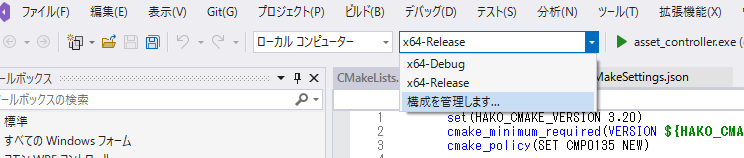
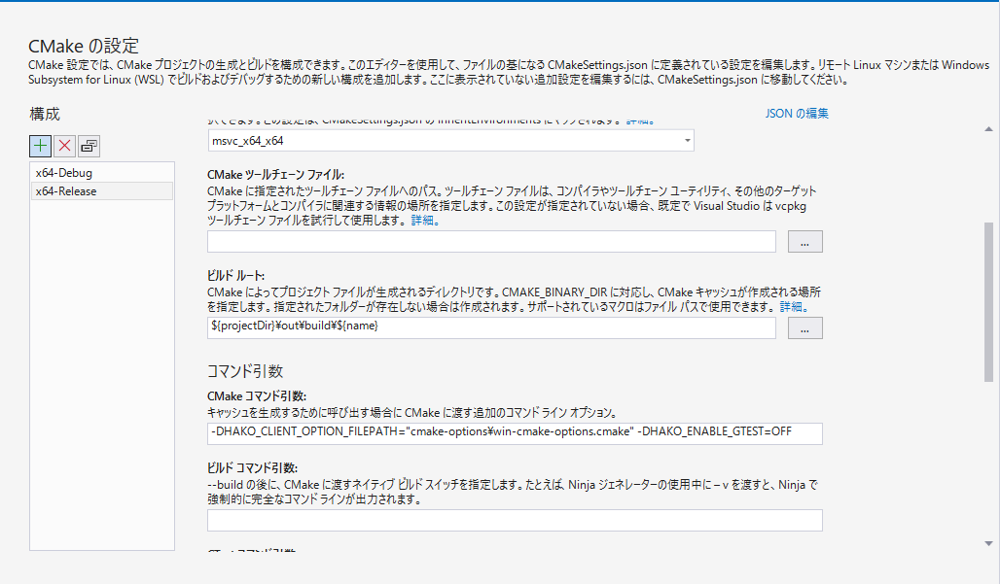
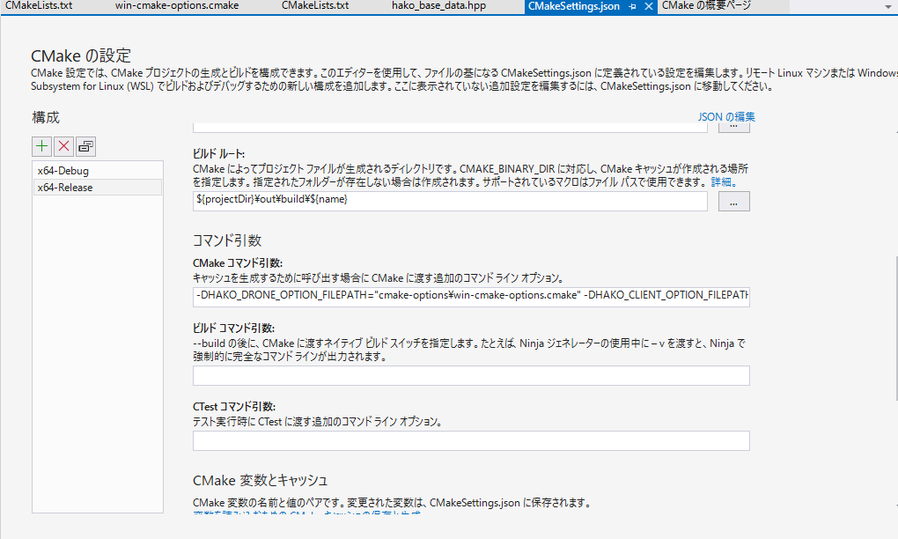
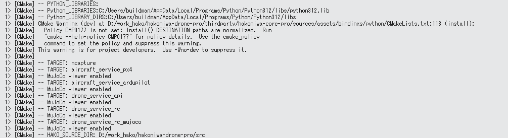

# 箱庭関連のリポジトリをVisual Studioでビルドするテクニック集

箱庭関連のリポジトリをクーロン後、Windows 11の`Visual Studio 2022 Community`でビルドする場合の`外部パッケージ利用`、`Warning`、`ビルドエラー`を対処する方法を記載しておきます。

## vcpkgの導入

箱庭関連のリポジトリでは、外部パッケージが必要になる場合があります。`Visual Studio 2022 Community`で外部パッケージを利用するには、`vcpkg`というコマンドを利用することで外部パッケージが利用できるようになります。

### vcpkgのインストール

Powershellを開きます。Powershellで適当なフォルダ(ここでは、d:\souce\repoフォルダとします。)に`vcpkg`をクーロンします。

```powershell
PS D:\source\repo> git clone https://github.com/Microsoft/vcpkg.git
```

クーロンができたら`bootstrap-vcpkg.bat`を実行して、`vcpkg.exe`を作成します。

```powershell
PS D:\source\repo\vcpkg> .\bootstrap-vcpkg.bat
```

実行すると`vcpkg.exe`ができあがります。

### Visual Studio 2022 Communityへの統合

`vcpkg.exe`ができあがったら、`Visual Studio 2022 Community`に統合します。

```powershell
PS D:\source\repo\vcpkg> .\vcpkg.exe integrate install
```

これで`Visual Studio 2022 Community`で`vcpkg`でインストールした外部パッケージが認識されるようになります。

## 箱庭関連のリポジトリ用の外部パッケージ利用

`vcpkg`がインストールできたら、箱庭関連のリポジトリで利用する外部パッケージをインストールしておきます。
箱庭関連のリポジトリ更新状況によって、必要な外部パッケージは変わりますので、随時対応をしてください。

```powershell
PS D:\source\repo\vcpkg> .\vcpkg.exe install rapidjson:x64-windows # json関連のパッケージ
PS D:\source\repo\vcpkg> .\vcpkg install gtest:x64-windows
PS D:\source\repo\vcpkg> .\vcpkg install glfw3:x64-windows
```

## 箱庭関連のリポジトリでのWarning、ビルドエラー対処テクニック

Visual Studio 2022 Communityを利用したビルド対処方法ですので、**Visual Studio 2022 Community以外のビルド方法**では不要です。

### GTestの無効化

`vcpkg`でGTestをインストールした場合は対処はいりません。もしくは、GTestなんてやりたくないな…などがあれば対処してください。

Visual Studio 2022 Communityで箱庭関連のリポジトリがあるフォルダを開きます。開いたら、`構成を管理します…`でCMakeSetting.jsonを開きます。



x64-Debug、x64-Releaseの両方のコマンド引数のCMakeコマンド引数に`-DHAKO_ENABLE_GTEST=OFF`を追加します。



### Windows用のCMakeオプション指定

箱庭関連のリポジトリでは、マルチプラットフォーム対応されており、`mac` `Linux` `Windows`用のCMakeオプションが用意されています。

Visual Studio 2022 Communityを利用する場合には、`Windows`用のCMakeオプションを設定しておく必要があります。

Visual Studio 2022 Communityで箱庭関連のリポジトリがあるフォルダを開きます。開いたら、`構成を管理します…`でCMakeSetting.jsonを開きます。


x64-Debug、x64-Releaseの両方のコマンド引数のCMakeコマンド引数に` -DHAKO_DRONE_OPTION_FILEPATH="cmake-options\win-cmake-options.cmake" -DHAKO_CLIENT_OPTION_FILEPATH="cmake-options\win-cmake-options.cmake" `を追加します。



### STANDARD 20対応

箱庭関連のリポジトリでビルドする場合、**D:\work_hako\hakoniwa-drone-pro\src\out\build\x64-Release\cl : コマンド ライン warning D9025: '/std:c++17' より '/std:c++20' が優先されます。**という`Waring`メッセージが出る場合があります。

この場合、Windows用のCMakeオプションを以下のように変更すると対処できます。CMakeList.txtの最初の方に`CMAKE_CXX_STANDARD 20`を設定しているため、Visual Studioでは、STANDARD 20が優先されてしまいます。

- 変更前

```CMake
# C++ standard
set(CMAKE_CXX_STANDARD 17)
set(CMAKE_CXX_STANDARD_REQUIRED ON)
```

- 変更後

```CMake
# C++ standard
if(NOT MSVC)
# C++ standard
set(CMAKE_CXX_STANDARD 17)
set(CMAKE_CXX_STANDARD_REQUIRED ON)
endif()
```

### CMakeでのinstall利用時のパス正規化

CMakeList.txtでinstallを指定している場合に`Warning`が出ることがあります。この場合、CMP0177を有効にして、install時のパス指定を正規化するように指示をします。CMake3.2以上を利用する場合には推奨される設定とのことです。(Copilot談)



各CMakeList.txtに以下を追加することで、`Warning`を対処することができます。気になるようなら指定してください。

CMakeList.txtの先頭位置くらいに以下を追加するようにしてください。

```CMake
if(POLICY CMP0177)
  cmake_policy(SET CMP0177 NEW)
endif()
```