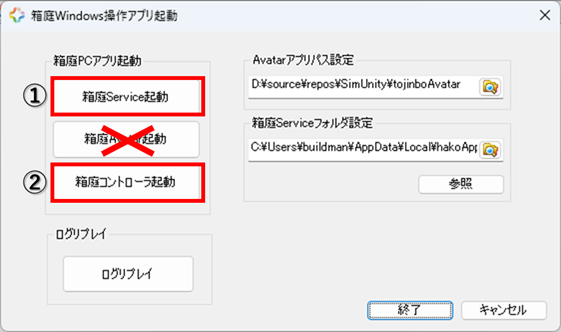
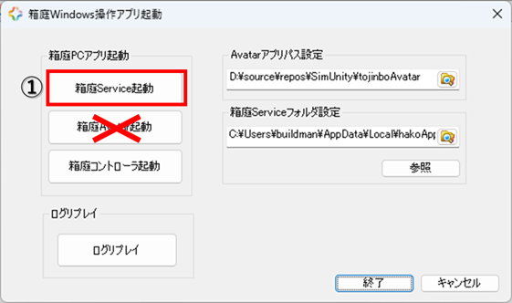
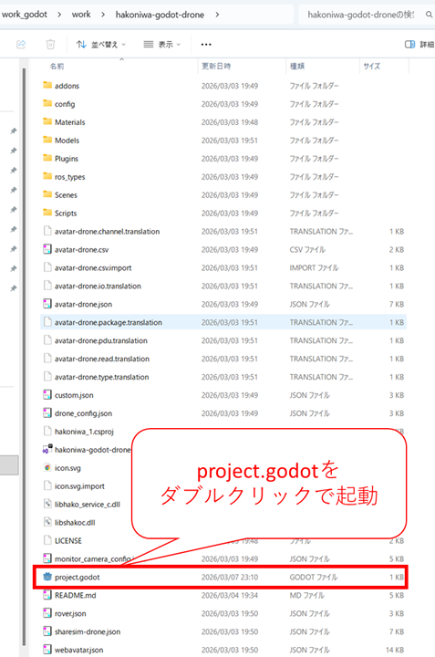
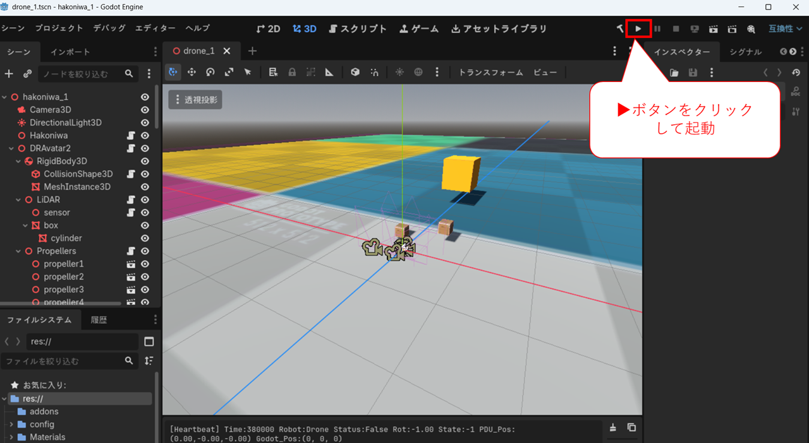
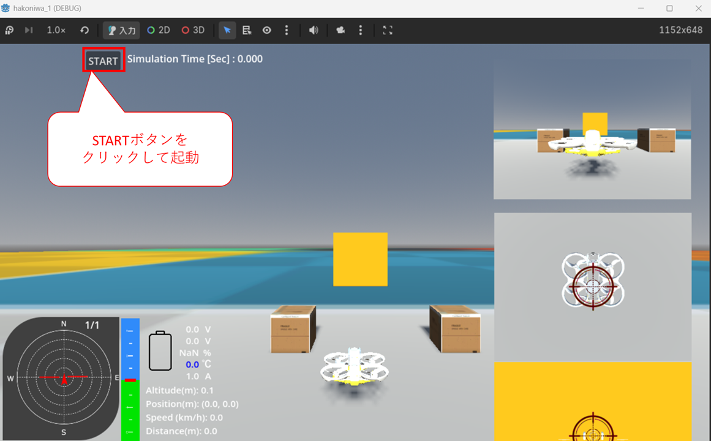
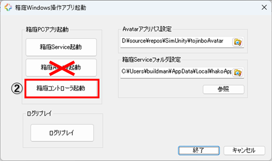

# 1. 本ドキュメント

このドキュメントは、Windows環境でGodotを使った箱庭ドローンシミュレータの動作をさせるための手順となります。

# 2. Godotのインストールについて

以下のドキュメントを参照して、事前にGodotをインストールしてください。

[Godotインストール方法](../preinstall-doc/godot.md)

# 3. 箱庭ドローンシミュレータのGodot版入手

箱庭ドローンシミュレータのGodot版をクーロンします。クーロンする場所は任意ですので、好きな場所にクーロンしてください。

```bash
git clone https://github.com/hako-community/hakoniwa-godot-drone.git
```

# 4. 箱庭ドローンシミュレータ Windowsアプリのインストール

以下のドキュメントを参照してWindows環境で使用できるアプリケーションをインストールします。

[箱庭コア機能インストール](../wininstall-doc/coreinstall.md)

[箱庭ドローンシミュレータアプリケーションインストール](../wininstall-doc/appsinstall.md)

# 5. 箱庭ドローンシミュレータ Godotの利用方法

以下の手順にて、箱庭ドローンシミュレータでGodot版が利用できます。

## 5.1. Windowsアプリの起動

Windowsアプリ起動は、[箱庭ドローンシミュレータ hakoWinAppsRC.exe 操作方法ドキュメント 起動方法](../winapps-doc/hakorc.md)の章を参照してください。

Godotを利用するにあたっては、hakoWinAppsRC.exeの機能として、`箱庭Avatar起動`は利用しませんので、注意してください。



### 5.1.1. 箱庭Serviceの起動

①となっている箱庭Service起動をクリックして、箱庭ドローンシミュレータを起動します。



起動するとpwoershell画面が起動します。

### 5.1.2. 箱庭ドローンシミュレータ Godot版起動

箱庭Serviceが起動したら、箱庭ドローンシミュレータ用の`Godot Project`を起動します。

gitでクーロンした場所に移動して、`project.godot`をダブルクリックして起動します。



ダブルクリックすると以下のような画面が起動するので、`▶ボタン`をクリックして、箱庭ドローンシミュレータのビジュアライズ画面を起動します。



`▶ボタン`をクリックすると、以下の画面が起動されますので、`STARTボタン`をクリックします。



### 5.1.3. ゲームパッドの起動

箱庭ドローンシミュレータでドローンを操作するためにゲームパッド制御を起動します。②の部分をクリックします。



クリックするとゲームパッドの選択画面が出てきますので、利用するゲームパッドを選択して、OKボタンをクリックします。


### 5.1.4. ゲームパッドの操作

Windowsアプリ起動は、[箱庭ドローンシミュレータ hakoWinAppsRC.exe 操作方法ドキュメント 例 PS4コントローラの操作定義](../winapps-doc/hakorc.md)の章を参照してください。
