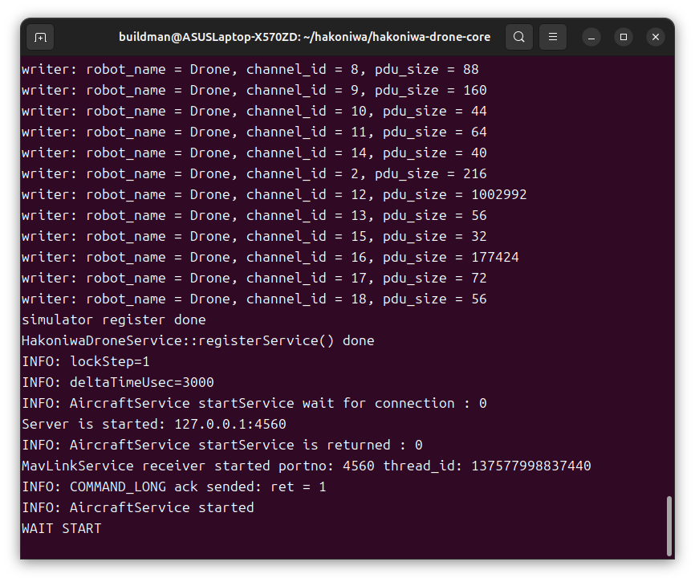
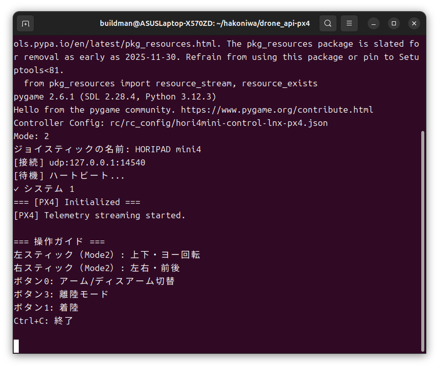
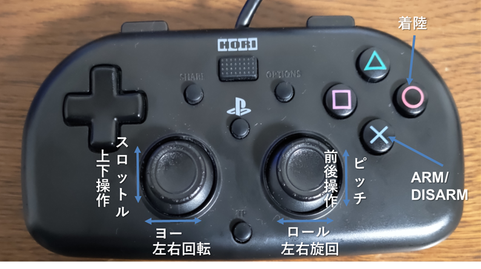
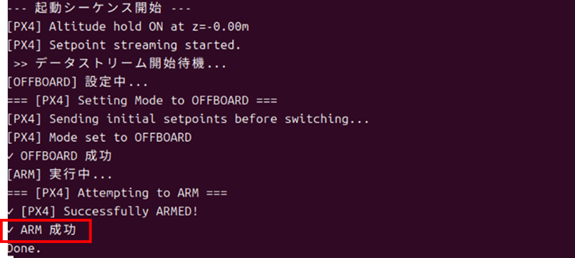
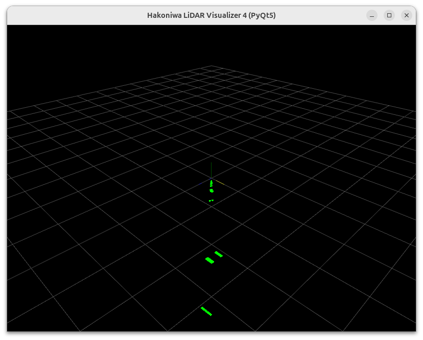

<div class="box-title">
    <p>
    <div style="font-size:18pt;font-weight:bold;text-align:center;margin-top:150px"><span class="title">箱庭ドローンシミュレータ PX4編</span></div>
    </p>
    <p>
    <div style="font-size:14pt;font-weight:bold;text-align:center;margin-top:20px"><span class="sub-title">PX4と連携したシミュレーション実行</span></div>
    </p>
    <p>
    <div style="font-size:12pt;font-weight:bold;text-align:center;margin-top:500px"><span class="author">箱庭ラボコミュニティ</span></div>
    </p>
</div>

<!-- 改ページ -->
<div style="page-break-before:always"></div>

<div style="font-size:18pt;font-weight:bold;text-align:left;"><span class="contents">目次</span></div>

<!-- TOC -->

- [1. 本ドキュメントについて](#1-本ドキュメントについて)
- [2. 各種インストールについて](#2-各種インストールについて)
  - [2.1. 必要なスクリプト類](#21-必要なスクリプト類)
  - [2.2. ビジュアライズ環境](#22-ビジュアライズ環境)
- [3. 箱庭ドローンシミュレータ+PX4の動作方法](#3-箱庭ドローンシミュレータpx4の動作方法)
  - [3.1. 事前準備](#31-事前準備)
    - [3.1.1. PX4のビルド](#311-px4のビルド)
    - [3.1.2. ドローンビジュアライズ環境の導入](#312-ドローンビジュアライズ環境の導入)
    - [3.1.3. スクリプトの導入](#313-スクリプトの導入)
  - [3.2. 動作確認](#32-動作確認)
    - [3.2.1. PX4の起動](#321-px4の起動)
    - [3.2.2. 箱庭ドローンシミュレータの起動](#322-箱庭ドローンシミュレータの起動)
    - [3.2.3. 箱庭ドローンシミュレータビジュアライズ環境の起動](#323-箱庭ドローンシミュレータビジュアライズ環境の起動)
    - [3.2.4. PX4操作用のスクリプト起動](#324-px4操作用のスクリプト起動)
      - [3.2.4.1. ドローンの操縦](#3241-ドローンの操縦)
- [4. 留意事項](#4-留意事項)
  - [4.1. 動作確認の手順について](#41-動作確認の手順について)
  - [4.2. 動作確認の環境について](#42-動作確認の環境について)
  - [4.3. PX4操作用のスクリプトについて](#43-px4操作用のスクリプトについて)
- [5. LiDARの可視化](#5-lidarの可視化)
  - [5.1. 動作方法](#51-動作方法)
    - [5.1.1. ドローンビジュアライズ+LiDARの可視化環境の起動](#511-ドローンビジュアライズlidarの可視化環境の起動)
    - [5.1.2. LiDARセンサの可視化スクリプト](#512-lidarセンサの可視化スクリプト)
      - [5.1.2.1. Pytho モジュールの導入](#5121-pytho-モジュールの導入)
      - [5.1.2.2. スクリプトの実行](#5122-スクリプトの実行)

<!-- /TOC -->


<!-- 改ページ -->
<div style="page-break-before:always"></div>


<div style="font-size:18pt;font-weight:bold;text-align:left;"><span class="contents">用語集・改版履歴</span></div>


|略語|用語|意味|
|:---|:---|:---|
||||


|No|日付|版数|変更種別|変更内容|
|:---|:---|:---|:---|:---|
|1|2026/01/05|0.1|新規|新規作成|
||||||

<!-- 改ページ -->
<div style="page-break-before:always"></div>

# 1. 本ドキュメントについて

本ドキュメントは、箱庭ドローンシミュレータとOSSのフライトコントローラ PX4を連動させて、シミュレーションの操作をする方法を解説しています。

対象のPlatformは、**Ubuntu 24.04 LTS**を想定しています。他のPlatformは対象外となります。

# 2. 各種インストールについて

以下のリンクを見て対応を行ってください。

[箱庭ドローンシミュレータ](../developer-doc/ubuntu-doc/ubuntu24.04hakodrone.md)

[ドローンビジュアライズ環境構築](../developer-doc/unity-doc/hako_unitybuild.md)

## 2.1. 必要なスクリプト類

以下のスクリプト類をダウンロードしてください。

[px4シミュレータ起動スクリプト](https://github.com/buildko89/documents/releases/download/v1.0.0_px4/px4sim.zip)

[px4をゲームパッドで操作するスクリプト](https://github.com/buildko89/documents/releases/download/v1.0.0_px4/drone_api-px4.zip)

[LiDARを可視化するスクリプト](https://github.com/buildko89/documents/releases/download/v1.0.0_px4/lidar_visual.zip)

## 2.2. ビジュアライズ環境

PX4と連携したドローン飛行のビジュアライズする環境になります。

[ドローンビジュアライズ環境](https://github.com/buildko89/documents/releases/download/v1.0.0_px4/WebAvatar.zip)

[ドローンビジュアライズ+LiDARの可視化環境](https://github.com/buildko89/documents/releases/download/v1.0.0_px4/LiDARAvatar.zip)

# 3. 箱庭ドローンシミュレータ+PX4の動作方法

箱庭ドローンシミュレータを使って、PX4と連動させる方法となります。

作業ディレクトリは、hakoniwaを想定しています。

```bash
$ cd
$ mkdir hakoniwa
```

## 3.1. 事前準備

PX4環境、ドローンビジュアライズ環境、各種スクリプトの導入を行います。

### 3.1.1. PX4のビルド
PX4をUbuntu 24.04環境で動作させるためにビルドして、起動させます。PX4をビルドするための作業ディレクトリを作成します。

```bash
$ cd
$ cd hakoniwa
$ mkdir px4
$ cd px4
```

px4sim.zipを解凍します。

```bash
$ unzip ~/Downlods/px4sim.zip
$ ls
hakoniwa-apps  sim
```

PX4のgithubから、PX4本体をクーロンして、ビルドします。ビルド手順は以下を参照してください。ディレクトリ構成などは読み替えて対応をしてください。

[PX4フライトコントローラのビルド](../developer-doc/px4-doc/px4_build.md)


### 3.1.2. ドローンビジュアライズ環境の導入

箱庭ドローンシミュレータ環境にドローンビジュアライズ環境の導入します。

```bash
$ cd ~/hakoniwa/hakoniwa-drone-core
$ mv WebAvatar WebAvatar.old
$ unzip ~/Downloads/WevAvatar.zip
$ unzip ~/Downloads/LiDARAvatar.zip
```

### 3.1.3. スクリプトの導入

PX4を操作するスクリプト、LiDARのデータを可視化するスクリプトを導入します。

```bash
$ cd ~/hakoniwa
$ unzip ~/Downloads/drone_api_px4.zip
$ unzip ~/Downloads/lidar_visual.zip
```

## 3.2. 動作確認

動作確認には、シェル画面が4つ必要になります。事前にシェル画面を4つ立ち上げておいてください。

### 3.2.1. PX4の起動

1つの目のシェル画面でPX4を起動します。

```bash
$ cd ~/hakoniwa/px4/PX4-Autopilot
$ bash ../sim/simstart.bash
```

起動すると以下のようなシェル画面になります。


### 3.2.2. 箱庭ドローンシミュレータの起動

PX4と連動させるため箱庭ドローンシミュレータの起動を行います。

```bash
$ cd ~/hakoniwa/hakoniwa-drone-core
```

```bash
./lnx/linux-main_hako_aircraft_service_px4 127.0.0.1 4560 ./config/drone/px4-1 ./WebAvatar/webavatar.json
```

起動すると以下のシェル画面になります。



このときにPX4のシェル画面にERRORが表示されますが問題ありません。


### 3.2.3. 箱庭ドローンシミュレータビジュアライズ環境の起動

ビジュアライズ環境を起動します。

```bash
$ ~/hakoniwa/hakoniwa-drone-core/WebAvatar
$ ./simulation.x86_64
```

起動すると以下のようなシェル画面になります。


ビジュアライズ画面が別の画面で起動されます。


ビジュアライズ画面が起動されたら`START`ボタンをクリックします。`START`ボタンをクリックすると、PX4のシェル画面のERRORがなくなれば箱庭ドローンシミュレータと連動できています。

### 3.2.4. PX4操作用のスクリプト起動

PS4、HoriPro miniなどゲームコントローラを接続して、PX4の操作ができるスクリプトを起動します。

```bash
$ cd ~/hakoniwa/drone_api-px4
$ python px4_rc_controller.py rc/rc_config/hori4mini-control-lnx-px4.json --connection udp:127.0.0.1:14540
```

PX4と連動できると以下のシェル画面になります。



PX4と操作スクリプトは、`UDP`通信しています。PX4と連動できるとPX4のシェル画面に`Ready for takeoff!`のように表示されます。


ゲームコントローラで操作できる内容は以下のようになっています。



#### 3.2.4.1. ドローンの操縦

まずは、ARMさせますので、✖ボタンをクリックします。

PX4と通信がうまくできると、以下のような画面になります。



ARMが成功したら、左スティックにて上にスロットルを入れます。
スロットルを入れることで、ドローンが上に浮上します。


あとは、左右のスティックで操縦ができます。PX4操作用のシェル画面に左右のスティックでの操縦内容が表示されます。


着陸時には、〇ボタンをクリックすると着陸が実行されます。

# 4. 留意事項

動作確認にあたっての留意点となります。

## 4.1. 動作確認の手順について

箱庭ドローンシミュレータ起動→箱庭ドローンシミュレータビジュアライズ環境の起動までは、時間制約があります。箱庭ドローンシミュレータビジュアライズ環境の起動が遅くなった場合には、`START`ボタンを押しても、シミュレーションが開始されない場合がありますので、`START`ボタン押してもシミュレーションが開始されないようでしたら、再度、PX4の手順からやり直してください。

## 4.2. 動作確認の環境について

PX4を用いた箱庭ドローンシミュレータ動作確認は、一度終了させると再度、各種起動が必要になります。動作確認手順を最初から行ってください。

## 4.3. PX4操作用のスクリプトについて

PX4とUDP通信するスクリプトとなっています。スクリプトの動作については、PX4側との状態があってないと動作しない場合があります。
PX4操作用のサンプルとして作成していますので、間違っている点などがある可能性はあります。


# 5. LiDARの可視化

箱庭ドローンシミュレータには、さまざまなセンサが実装されています。障害物検知などをするためのLiDARセンサの動作確認環境も提供しています。

## 5.1. 動作方法

箱庭ドローンシミュレータビジュアライズ環境の起動手順の時にLiDARセンサの可視化できる環境を起動するようにしてください。

### 5.1.1. ドローンビジュアライズ+LiDARの可視化環境の起動

ビジュアライズ環境を起動します。

```bash
$ ~/hakoniwa/hakoniwa-drone-core/LiDARAvatar
$ ./simulation.x86_64
```

起動すると以下のようなシェル画面になります。ビジュアライズ画面が起動されたら`START`ボタンをクリックしてください。


`START`ボタンをクリックすると、PX4のシェル画面のERRORがなくなれば箱庭ドローンシミュレータと連動できています。

`START`ボタンクリック後に、左下にあるLiDARセンサ用の設定をさまざま変更できるので、用途に合わせて使ってください。

### 5.1.2. LiDARセンサの可視化スクリプト

ドローンビジュアライズ+LiDARの可視化環境を用いなくても可視化できるスクリプトも準備しています。用途に合わせて可視化モードを利用してください。

#### 5.1.2.1. Pytho モジュールの導入

以下のものをpipコマンドでインストールしてください。

```bash
pip install PyOpenGL PyOpenGL_accelerate
pip install pyqtgraph
pip install pyqt5
pip install open3d
```

#### 5.1.2.2. スクリプトの実行

```bash
$ cd ~/hakoniwa/lidar_visual
$ python lidar_visualizer4.py cpp_core_config.json --mode pyqt5
```

起動すると以下のシェル画面になります。


Qt5を用いてビジュアライズ画面が表示されます。




‐ lidar_visualizer4.py利用オプション

```txt
python lidar_visualizer4.py
usage: lidar_visualizer4.py [-h] [--pdu_config_path PDU_CONFIG_PATH]
                            [--robot_name ROBOT_NAME]
                            [--pdu_channel PDU_CHANNEL]
                            [--mode {open3d,matplotlib,pyqt5}]
                            [--delta_msec DELTA_MSEC]
                            core_config_path
```

用途に合わせて使い分けてください。