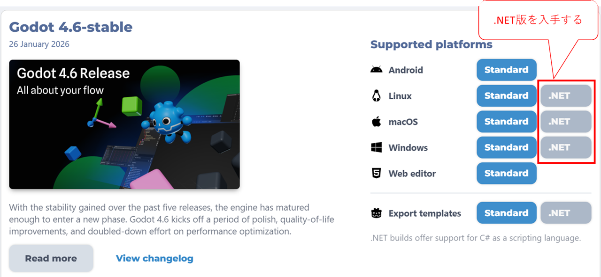
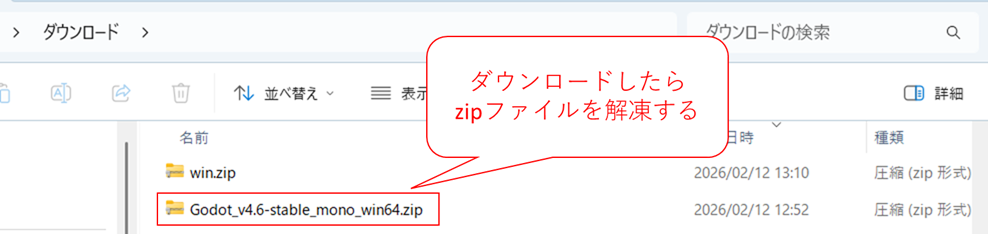
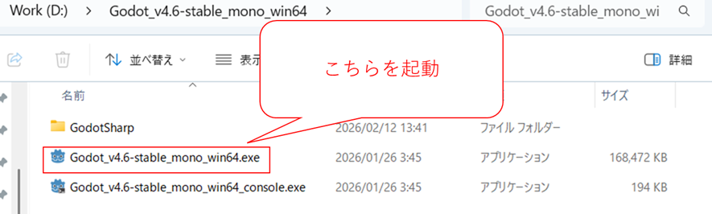
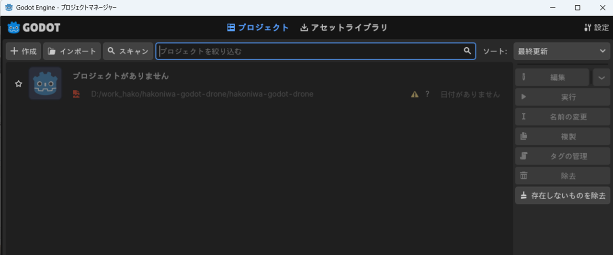

# 1. Godotの利用

Unity以外にビジュアライズすることができるgodotがあります。
このドキュメントでは、godotを箱庭ドローンシミュレータでビジュアライズに利用するためのインストール手順を紹介しています。

# 2. Godotについて

2D、3Dゲームに対応した無料・オープンソース(MITライセンス)のクロスプラットフォーム・ゲームエンジンになります。詳細は以下のリンクを参照ください。

[Godotホームページ](https://godotengine.org/ja/)

## 2.1. Godotの入手

箱庭ドローンシミュレータでは、Godot ver4.6での動作確認をしているので、Godot ver4.6を入手します。(2026/03時点で最新はver4.6.1になってます。)

以下のリンクをクリックします。

[Godot ver4.6入手先](https://godotengine.org/download/archive/4.6-stable/)

クリックすると以下のページが表示されます。箱庭ドローンシミュレータのGodotでのビジュアライズ機能は、C#で開発されているので、`.Net`版を入手します。

`.Net`の部分をクリックするとダウンロードが開始されます。
ダウンロードが完了すると、zipファイルが入手できますので、zipファイルをインストールしたい場所に解凍します。

## 2.2. Godotの動作確認

zipファイルを解凍して、インストールしたい場所においたら、Godotを起動が起動できます。

exeファイルをダブルクリックして起動すると、以下のような画面が立ち上がってくれば成功です。

