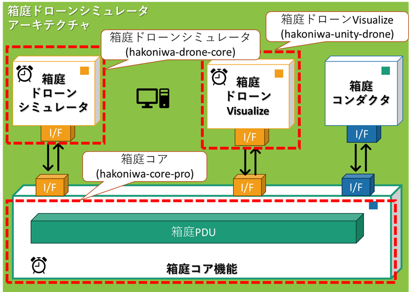

<div class="box-title">
    <p>
    <div style="font-size:18pt;font-weight:bold;text-align:center;margin-top:150px"><span class="title">箱庭ドローンシミュレータ on Ubuntu24.04 </span></div>
    </p>
    <p>
    <div style="font-size:14pt;font-weight:bold;text-align:center;margin-top:20px"><span class="sub-title">インストール手順</span></div>
    </p>
    <p>
    <div style="font-size:12pt;font-weight:bold;text-align:center;margin-top:500px"><span class="author">箱庭ラボコミュニティ</span></div>
    </p>
</div>

<!-- 改ページ -->
<div style="page-break-before:always"></div>

<div style="font-size:18pt;font-weight:bold;text-align:left;"><span class="contents">目次</span></div>

<!-- TOC -->

- [1. 本ドキュメントについて](#1-本ドキュメントについて)
- [2. 箱庭ドローンシミュレータ用のリポジトリの説明](#2-箱庭ドローンシミュレータ用のリポジトリの説明)
- [3. 箱庭ドローンシミュレータの利用](#3-箱庭ドローンシミュレータの利用)
  - [3.1. 箱庭ドローンシミュレータのインストール](#31-箱庭ドローンシミュレータのインストール)
    - [3.1.1. 箱庭コア機能](#311-箱庭コア機能)
    - [3.1.2. 箱庭Pythoモジュール](#312-箱庭pythoモジュール)
      - [3.1.2.1. python site-packageの導入](#3121-python-site-packageの導入)
  - [3.2. mujocoのインストール](#32-mujocoのインストール)
- [4. トラブルシュート](#4-トラブルシュート)
  - [4.1. mmapの権限](#41-mmapの権限)

<!-- /TOC -->


<!-- 改ページ -->
<div style="page-break-before:always"></div>


<div style="font-size:18pt;font-weight:bold;text-align:left;"><span class="contents">用語集・改版履歴</span></div>


|略語|用語|意味|
|:---|:---|:---|
||||


|No|日付|版数|変更種別|変更内容|
|:---|:---|:---|:---|:---|
|1|2026/01/02|0.1|新規|新規作成|
||||||

<!-- 改ページ -->
<div style="page-break-before:always"></div>

# 1. 本ドキュメントについて

Ubuntu 24.04上で、箱庭ドローンシミュレータを動作させるためのインストール手順になります。

‐ 利用する環境一覧

|利用環境名|説明|備考|
|:---|:---|:---|
|OS|Ubuntu 24.04|LTSのものを選択。インストール手順は割愛|
|Python|3.12|Pyenvの仮想環境を利用|
|ビルド環境|Ubuntu 24.04で利用できるコンパイラなど|事前にインストール必要|

**本ドキュメントでは、githubからのクーロンやUbuntuのコマンド操作部分などで、コピー&ペーストが必要な部分には、$等は含みません**

# 2. 箱庭ドローンシミュレータ用のリポジトリの説明

Ubuntu 24.04で利用する箱庭ドローンシミュレータ用のリポジトリは3つになります。



- 箱庭ドローンシミュレータ用のリポジトリ説明

|リポジトリ名|説明|リンク|
|:---|:---|:---|
|箱庭コア|箱庭アセットなど箱庭の機能を統合してリアルタイムOSのように各機能の「指揮者」の役割をする機能|[hakoniwa-core-pro](https://github.com/hakoniwalab/hakoniwa-core-pro.git)|
|箱庭ドローンシミュレータ|ドローン飛行の制御を担う機能|[hakoniwa-drone-core](https://github.com/toppers/hakoniwa-drone-core.git)|
|箱庭ドローンVisualize|箱庭ドローンシミュレータでのドローン飛行などをビジュアライズする機能|[hakoniwa-unity-drone](https://github.com/hakoniwalab/hakoniwa-unity-drone.git)|

各機能をgithubからクーロンして利用します。本ドキュメントでは、箱庭ドローンシミュレータは、`OSS版`を利用します。箱庭ドローンVisualizeは、`Unity版`を利用します。

# 3. 箱庭ドローンシミュレータの利用

本ドキュメントは、箱庭ドローンシミュレータのリポジトリを対象にしたものになります。作業用のディレクトリとして、hakoniwaディレクトリ作成した解説となります。

```bash
$ cd
$ mkdir hakoniwa
```

## 3.1. 箱庭ドローンシミュレータのインストール

githubからクーロンを行います。

```bash
$ cd
$ cd hakoniwa
```
```git
git clone --recursive https://github.com/toppers/hakoniwa-drone-core.git
```

クーロンができたら、箱庭ドローンシミュレータのインストールを実行します。

```bash
bash install-drone-ubuntu.bash
```

インストール用のスクリプトを実行すると、以下のように`sudoコマンド`のパスワードを聞かれますので、パスワードを入力して実行してください。パスワード入力がなければ、以下の部分は無視してください。

```txt
[ 1/1 ] Preflight checks (apt environment & build deps)
[sudo] password for buildman:
```

最後に以下のメッセージが出力されたらインストール完了です。

```txt
 :
中略
 :
All done! Current Python: Python 3.12.3
Tip: open a new shell so your /home/buildman/.bashrc changes take effect there too.
```

インストールされると、`.bashrc`が更新されますので、再読み込みするか、シェル画面を再起動してください。

### 3.1.1. 箱庭コア機能

`install-drone-ubuntu.bash`で箱庭ドローンシミュレータが利用する箱庭コア機能は、debパッケージとしてインストールされます。本手順でインストールをした場合には、箱庭コア機能のインストールは不要になります。

### 3.1.2. 箱庭Pythoモジュール

`install-drone-ubuntu.bash`で箱庭ドローンシミュレータが利用する箱庭pythonモジュールは、Pythonの仮想環境にsite-packageとしてインストールされます。本手順でインストールをした場合には、箱庭Pythonモジュールのインストールは不要になります。

#### 3.1.2.1. python site-packageの導入

以下のPythonモジュールをインストールしてください。

```bash
$ pip install pygame
$ pip install numpy
$ pip install opencv-python
```


## 3.2. mujocoのインストール

箱庭ドローンシミュレータでは、物理的なシミュレーション部分をMuJoCoといわれるライブラリを使って対応しています。
箱庭ドローンシミュレータを利用するためには、MuJoCoをインストールする必要があります。手順は、以下になります。

[MuJoCoインストール](../mujoco-doc/hako_libinst.md)


# 4. トラブルシュート

箱庭ドローンシミュレータの利用時にトラブルとなる部分を列挙しておきます。
随時更新予定ですので、現時点で分かっているものだけを記載しています。

## 4.1. mmapの権限

/var/lib/hakoniwa/mmap/に箱庭ドローンシミュレータが利用するmmap(共有メモリ)が作成されます。権限の問題で、以下のようなERRORが発生する場合があります。

```error
ERROR: can not create mmap file:/var/lib/hakoniwa/mmap/mmap-0xff.bin
ERROR: hako_mmap_create() id=255 size=1129608 error=13
ASSERTION FAILED:./hakoniwa-core-cpp/src/hako/data/hako_master_data.hpp:init:58:shmid >= 0ERROR: can not create flock file:/var/lib/hakoniwa/mmap/flock.bin
Segmentation fault (core dumped)
```

この場合には、以下のように権限を変更することでERRORを回避することができます。

```bash
sudo chmod 755 /var/lib/hakoniwa
sudo chmod 777 /var/lib/hakoniwa/mmap/
```