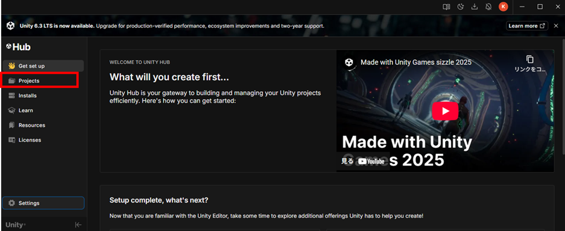
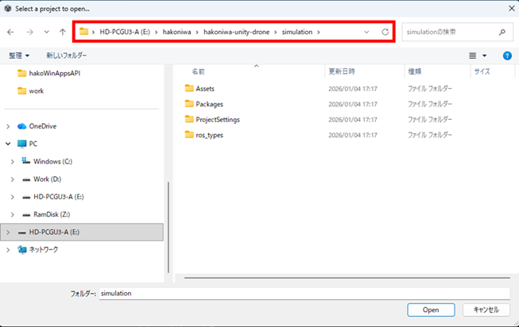
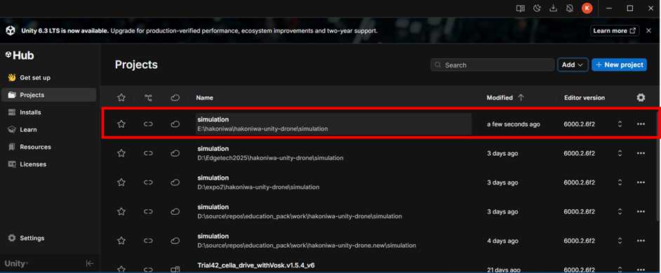
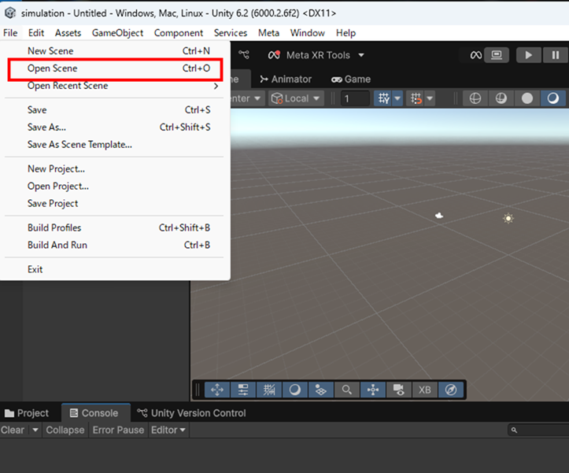
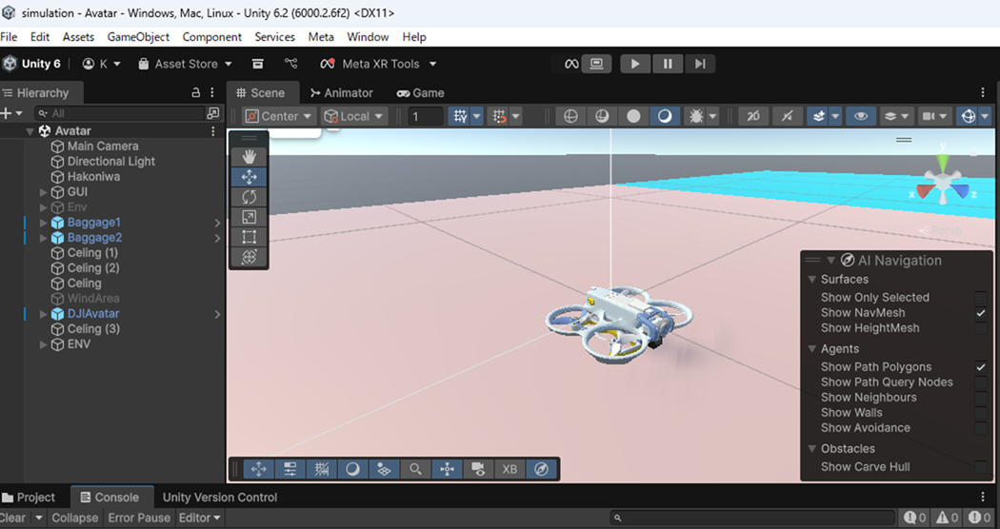
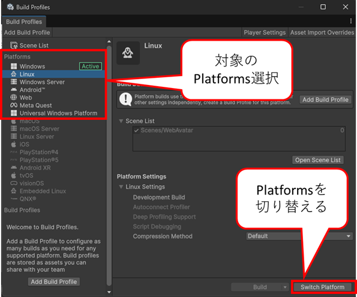
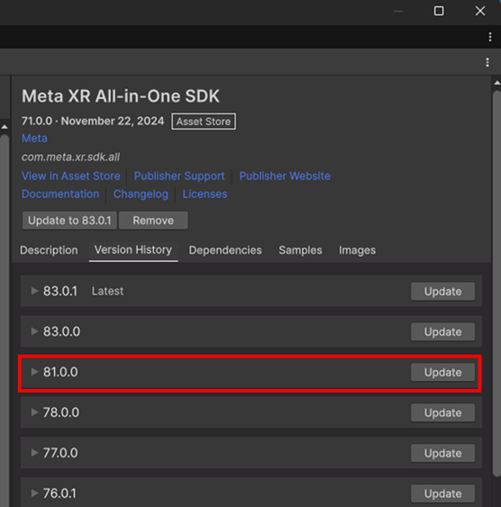

<div class="box-title">
    <p>
    <div style="font-size:18pt;font-weight:bold;text-align:center;margin-top:150px"><span class="title">箱庭ドローンシミュレータ Visualize:Unity </span></div>
    </p>
    <p>
    <div style="font-size:14pt;font-weight:bold;text-align:center;margin-top:20px"><span class="sub-title">hakoniwa-unity-droneのビルド編</span></div>
    </p>
    <p>
    <div style="font-size:12pt;font-weight:bold;text-align:center;margin-top:500px"><span class="author">箱庭ラボコミュニティ</span></div>
    </p>
</div>

<!-- 改ページ -->
<div style="page-break-before:always"></div>

<div style="font-size:18pt;font-weight:bold;text-align:left;"><span class="contents">目次</span></div>

<!-- TOC -->

- [1. 本ドキュメントについて](#1-本ドキュメントについて)
- [2. Unityのインストールについて](#2-unityのインストールについて)
- [3. 箱庭ドローンシミュレータのビジュアライズ方法](#3-箱庭ドローンシミュレータのビジュアライズ方法)
  - [3.1. 箱庭ドローンシミュレータのUnity版利用](#31-箱庭ドローンシミュレータのunity版利用)
  - [3.2. Unityの起動](#32-unityの起動)
    - [3.2.1. Unity Hubの操作](#321-unity-hubの操作)
    - [3.2.2. Unityの操作](#322-unityの操作)
      - [3.2.2.1. ビルドの実行](#3221-ビルドの実行)
- [4. トラブルシューティング](#4-トラブルシューティング)
  - [4.1. Meta SDKの環境設定](#41-meta-sdkの環境設定)
  - [4.2. Meta SDKのVersion](#42-meta-sdkのversion)
    - [4.2.1. Linux版のビルド時の注意](#421-linux版のビルド時の注意)

<!-- /TOC -->


<!-- 改ページ -->
<div style="page-break-before:always"></div>


<div style="font-size:18pt;font-weight:bold;text-align:left;"><span class="contents">用語集・改版履歴</span></div>


|略語|用語|意味|
|:---|:---|:---|
||||


|No|日付|版数|変更種別|変更内容|
|:---|:---|:---|:---|:---|
|1|2026/01/04|0.1|新規|新規作成|
||||||

<!-- 改ページ -->
<div style="page-break-before:always"></div>

# 1. 本ドキュメントについて

本ドキュメントは、箱庭ドローンシミュレータを利用する場合にビジュアライズのためにUnityを利用する場合のビルド方法となります。

- UnityのVersion

**Unity Version 6.2**が対象になります。その他のVersionでは操作方法などが違う可能性があります。

また、本ドキュメントは、**Windows OS対象**です。他のOSの操作は解説していません。

# 2. Unityのインストールについて

Unityのインストールについては、以下のドキュメントを参照してください。利用方法の注意点も良く読んで確認してください。

[Unityのインストール方法](../../preinstall-doc/unity_install.md)

# 3. 箱庭ドローンシミュレータのビジュアライズ方法

箱庭ラボさんが公開している箱庭ドローンシミュレータ用のUnity用のビジュアライズリポジトリを利用します。

[箱庭ラボ:hakoniwa-unity-drone](https://github.com/hakoniwalab/hakoniwa-unity-drone.git)

## 3.1. 箱庭ドローンシミュレータのUnity版利用

本ドキュメントは、箱庭ドローンシミュレータのUnity版のリポジトリを対象にしたものになります。作業用のディレクトリとして、hakoniwaディレクトリ作成した解説となります。

```bash
$ cd
$ mkdir hakoniwa
```

箱庭ドローンシミュレータのUnity版のリポジトリをクーロンします。


```bash
$ cd
$ cd hakoniwa
```

```bash
git clone --recursive https://github.com/hakoniwalab/hakoniwa-unity-drone.git
```

## 3.2. Unityの起動

ディスクトップ上にあるUnity HubのアイコンをクリックしてUnity Hubを起動します。Unity Hubのバージョンは、3.15.4(2026年01時点)となります。


### 3.2.1. Unity Hubの操作

Unity Hubが起動すると以下のような画面になります。左のメニューからProjectsをクリックします。



ProjectsをクリックするとUnity Hubにプロジェクトを登録する画面になります。


Addとなっている部分をクリックして、`Add project from disk`を選択します。
選択するとフォルダの選択画面が出てきます。先ほどクーロンした`hakoniwa-unity-drone\simulation`のフォルダを選択します。



フォルダの選択をするとUnity HubにProjectが登録されます。



登録されたProjectをクリックして、Projectをロードします。


ロードが始まるとUnityがスクリプトなどのビルドをしながら立ち上がってくるので、Projectが立ち上がったくるまで待ちます。

### 3.2.2. Unityの操作

Unityが立ち上がると空のシーンが開きます。Fileメニューから、`Open Scene`を選択してシーンを開きます。




シーンは、`hakoniwa-unity-drone\simulation\Scene`フォルダにあるので、Avatar.unityを選択します。


Avatarシーンが開らくと以下のような画面になります。



#### 3.2.2.1. ビルドの実行

UnityのFileメニューから`Build Profiles`を選択します。


`Build Profiles`を選択すると、各Platformsの設定画面が左に表示されるので、ターゲットとなるPlatformsを選択します。`Active`と表示されていないPlatformを選択した場合には、右下の`Switch Platform`をクリックして`Active`にする必要があります。



`Active`にできたら、右下のBuildボタンの🔽の部分をクリックして、`Clean Build…`をクリックします。


クリックするとビルド結果を出力するフォルダを選択するように指示されるので、右クリックにて適切なフォルダ名を作成してください。


フォルダの選択ができるとビルドが始まります。ビルドが完了するまで待ってください。もし、Errorが出た場合などは、対応を行ってください。

# 4. トラブルシューティング

箱庭ドローンシミュレータのUnity版は、Meta Quest3/Quest3SでAndroidアプリを作成できるようになっています。Unityの画面に以下のようになっている場合には、Meta SDK側の設定を変更する必要があります。

## 4.1. Meta SDKの環境設定

Meta SDKは、Unity起動時にErrorとなっている場合があります。Unityメニューの下に♾️Meta XR Toolsの部分に🔴になっている場合には、環境設定を変更する必要あります。

♾️Meta XR Toolsをクリックして、対象になるPlatformの画面にて、`Fix All`と表示されているようなら`Fix All`をクリックして環境設定を反映するようにしてください。


## 4.2. Meta SDKのVersion

Meta SDKは、現時点で`83.0.1`となっています。ただ、箱庭ドローンシミュレータのUnity版では、最新環境に対応していませんので、Meta SDKのVersionは、最新にしないでください。

また、Meta SDKは、Version 74以降では、`Open XR`を利用するように推奨されています。箱庭ドローンシミュレータのUnity版は、`Open XR`対応はしていないので、`Open XR`を導入するとビルドができなくなるので導入はしないでください。

### 4.2.1. Linux版のビルド時の注意

箱庭ドローンシミュレータのUnity版をLinux Platform用にビルドする場合には、Meta SDKのVersionをアップデートする必要があります。Meta SDK Version 71ではビルドができないです。

Windowsメニューから`Package Management→Package Manager`を開きます。


Package Managerが開いたら、`Meta XR All-in-One SDK`を探して選択します。選択できたら右側の`Version History`をクリックします。


`Version History`をクリックすると現状のVersionと最新バージョンが表示されます。下の方にある`See other version`のボタンをクリックします。


`See other version`をクリックすると、利用できるVersionが表示されますので、`81.0.0`にUpdateしてください。



Version `81.0.0`のUpdateをすることで、Windows用、Linux用のビルドはできるようになります。