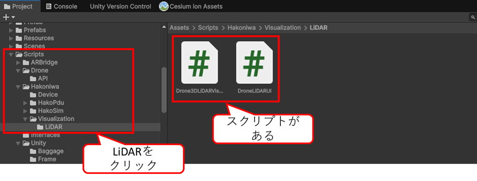
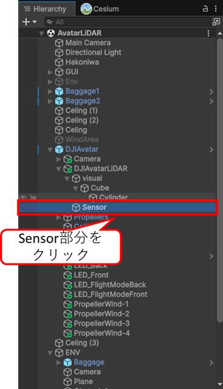
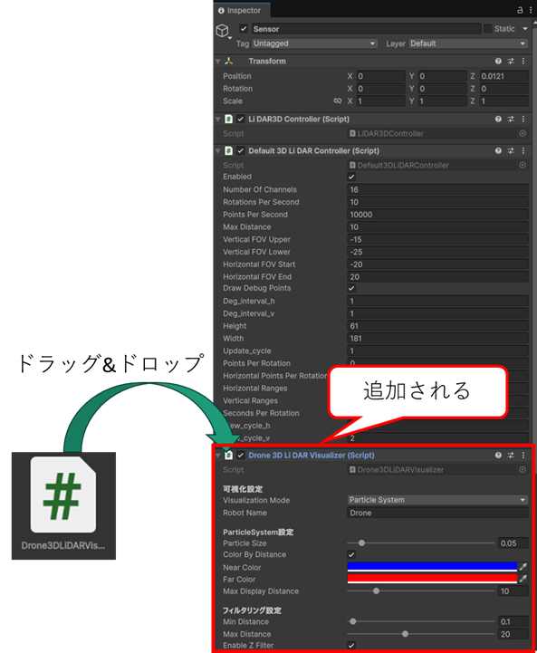
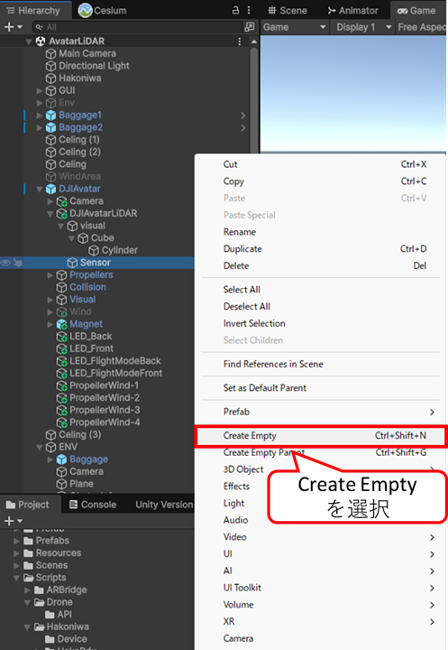
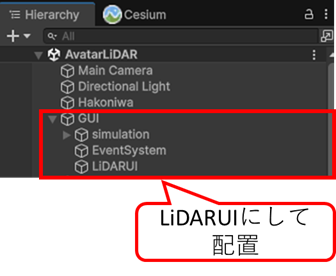

    

    
箱庭ドローンシミュレータ Unity
    アプリケーション編 

    

    

    
LiDARセンサ可視化方法

    

    

    
箱庭ラボコミュニティ

    

<!-- 改ページ -->

目次

<!-- TOC -->

- [1. 本ドキュメントについて](#1-本ドキュメントについて)
- [2. UnityアプリケーションへのLiDAR追加](#2-unityアプリケーションへのlidar追加)
  - [2.1. 既存のUnityアプリケーション利用](#21-既存のunityアプリケーション利用)
  - [2.2. LiDAR可視化用のAssets](#22-lidar可視化用のassets)
    - [2.2.1. LiDAR可視化用のスクリプト配置](#221-lidar可視化用のスクリプト配置)
      - [2.2.1.1. LiDARセンサデータ可視化用のスクリプト配置](#2211-lidarセンサデータ可視化用のスクリプト配置)
      - [2.2.1.2. LiDARセンサデータの可視化UI用のスクリプト配置](#2212-lidarセンサデータの可視化ui用のスクリプト配置)
  - [2.3. 動作確認](#23-動作確認)

<!-- /TOC -->

<!-- 改ページ -->

用語集・改版履歴

|略語|用語|意味|
|:---|:---|:---|
||||

|No|日付|版数|変更種別|変更内容|
|:---|:---|:---|:---|:---|
|1|2026/01/15|0.1|新規|新規作成|
||||||

<!-- 改ページ -->

# 1. 本ドキュメントについて

本ドキュメントは、箱庭ドローンシミュレータのUnityアプリケーションにLiDARセンサのセンシング状態を可視化するための追加方法になります。

# 2. UnityアプリケーションへのLiDAR追加

箱庭ドローンシミュレータの既存のPJを使って、ドローンの機体に搭載されているLiDARセンサからセンシング状態を可視化するためにアセット、スクリプトを追加します。

## 2.1. 既存のUnityアプリケーション利用

最初に箱庭ドローンシミュレータの既存Unityアプリケーションを開きます。

Assets/ScenesにあるAvatar.unityを選択して開きます。

Avatarアプリを開いたら、Fileメニュー→Save As...を選択して別名で保存します。本ドキュメントでは、`LiDARAvatar`という名前で保存します。

## 2.2. LiDAR可視化用のAssets

箱庭ドローンシミュレータのhakoniwa-unity-droneにはLiDARを可視化するためのAssetsが用意されています。

Assets/Scripts/Hakoniwa/VisualizeにLiDARディレクトリがあるります。このスクリプトを利用してLiDARの可視化をします。

### 2.2.1. LiDAR可視化用のスクリプト配置

`Hierarchy`のDJIAvatar/DJIAvatarLiDAR/Sensorを選択します。

SensorがLiDARセンサになります。

#### 2.2.1.1. LiDARセンサデータ可視化用のスクリプト配置

`Hierarchy`のDJIAvatar/DJIAvatarLiDAR/Sensorを選択した状態で`Inspecor`にDrone3DLiDARVisualizer.csのスクリプトをドラッグ&ドロップで配置します。

#### 2.2.1.2. LiDARセンサデータの可視化UI用のスクリプト配置

`Hierarchy`で、右クリックして、Create Emptyのオブジェクトを作成します。

作成したオブジェクトの名前を`LiDARUI`に変更して、GUIに配置します。

配置したら、LiDARUIを選択した状態で、`Inspecor`にDroneLiDARUI.csのスクリプトをドラッグ＆ドロップで配置します。

## 2.3. 動作確認

ここまでの配置が完了したら、Unityにてビルドを実行するか、Playボタンで実行すると、LiDARの可視化を体験することができます。

Unityのビルドの詳細については、[hakoniwa-unity-droneのビルド編](./hako_unitybuild.md)などを参考にしてください。
