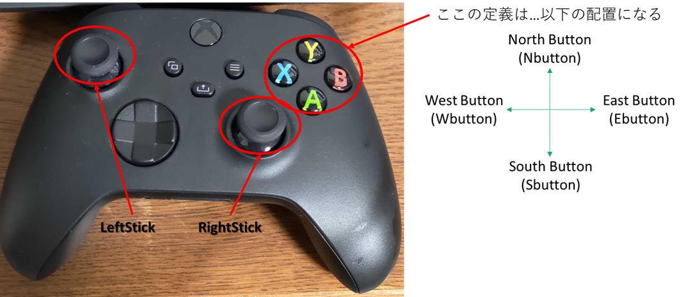
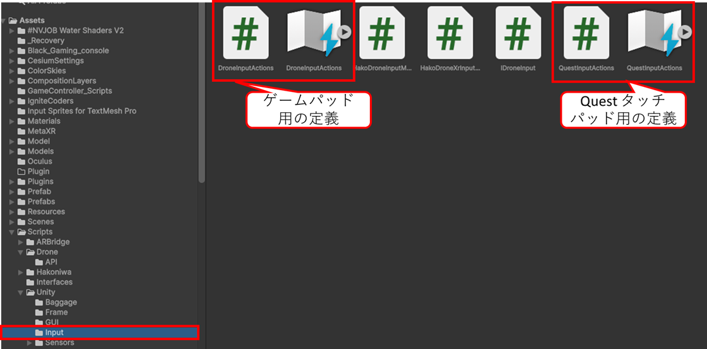
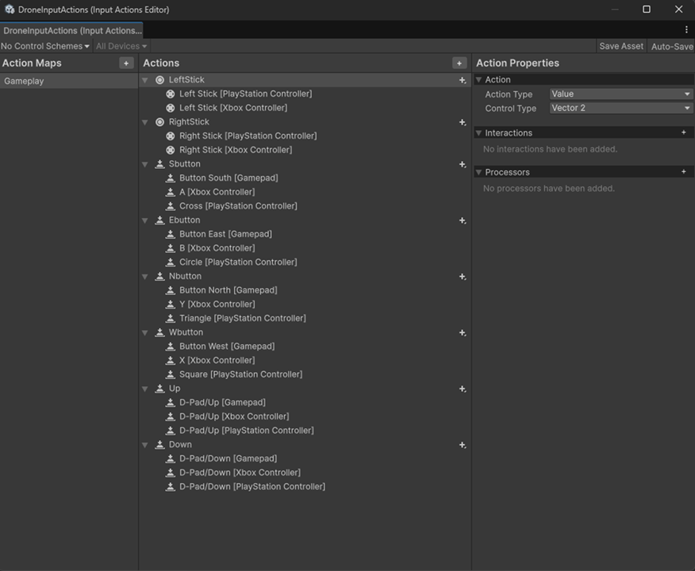
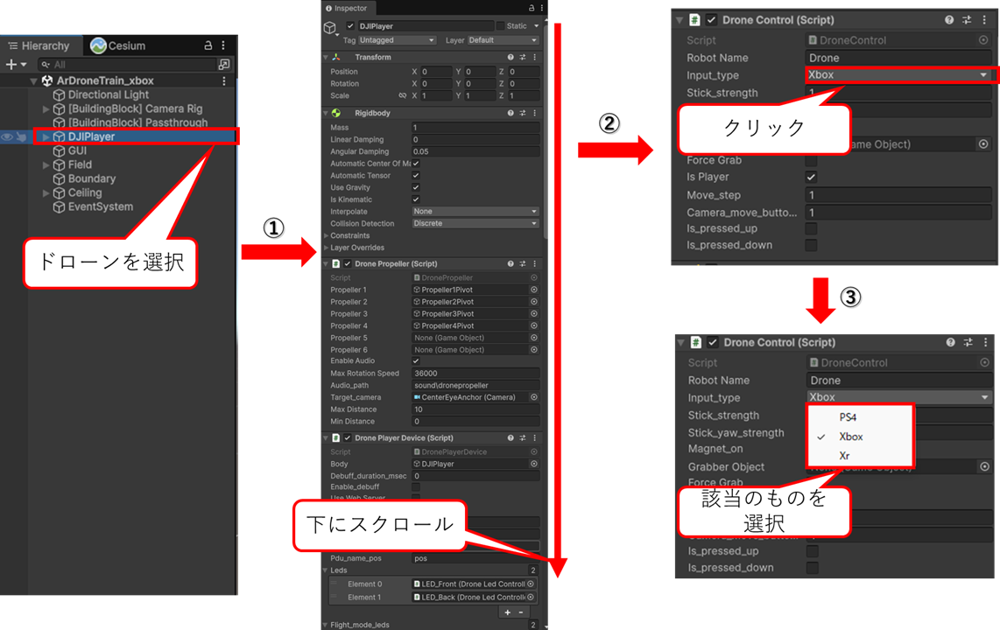
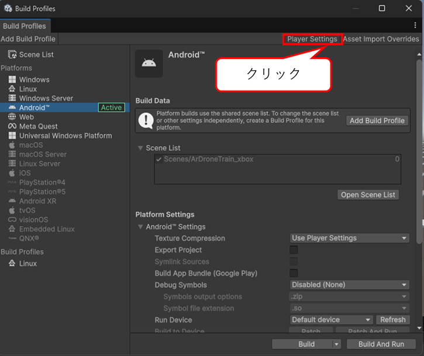

    

    
箱庭ドローンシミュレータ Quest3/3S ARアプリケーション編 

    

    

    
Quest3/3SでのGamepad利用方法

    

    

    
箱庭ラボコミュニティ

    

<!-- 改ページ -->

目次

<!-- TOC -->

- [本ドキュメントについて](#本ドキュメントについて)
- [UnityでのInputSystemについて](#unityでのinputsystemについて)
  - [InputSystem詳細…←これはあとで書く](#inputsystem詳細これはあとで書く)
  - [InputSystemでのゲームパッドの各名称についえ](#inputsystemでのゲームパッドの各名称についえ)
    - [例:Xboxゲームパッドの配置](#例xboxゲームパッドの配置)
- [InputSystemの定義について](#inputsystemの定義について)
  - [DroneInputActions.inputactionsの変更方法](#droneinputactionsinputactionsの変更方法)
    - [Xbox用定義の追加](#xbox用定義の追加)
  - [ビルド](#ビルド)
    - [ビルド前のコンフィグ作業](#ビルド前のコンフィグ作業)
    - [ビルド](#ビルド-1)
- [ゲームパッドの追加について](#ゲームパッドの追加について)
- [ゲームパッドのAsset追加](#ゲームパッドのasset追加)
  - [Unity Assetの利用](#unity-assetの利用)
  - [Assetの利用](#assetの利用)

<!-- /TOC -->

<!-- 改ページ -->

用語集・改版履歴

|略語|用語|意味|
|:---|:---|:---|
||||

|No|日付|版数|変更種別|変更内容|
|:---|:---|:---|:---|:---|
|1|2026/01/12|0.1|新規|新規作成|
||||||

<!-- 改ページ -->

# 本ドキュメントについて

本ドキュメントは、Unityを使ったQuest3/3Sでのゲームパッドを利用できるようにするためのドキュメントとなります。

対象となるゲームパッドは、Xbox用のゲームパッドとなります。
UnityのVersionは、6.2を対象にしています。

# UnityでのInputSystemについて

Unityのアプリケーションでは、InputSystemという入力をコントロールする機能が用意されています。このInputSystemを利用してゲームパッドがQuest3/3Sにて使えるようにできます。

## InputSystem詳細…←これはあとで書く

## InputSystemでのゲームパッドの各名称についえ

ゲームパッドは、左右スティック、各種ボタンがあります。これらの名称がInputSystem上で名称が決まっています。ゲームパッドを利用する場合には、InputSystem側の名称に合わせて、ゲームパッド側の左右スティック、各種ボタンを配置する必要があります。

- 表.各ゲームパッドとInputSystemの名称

|ゲームパッド名称|Xboxでの名称|PS4での名称|Input System名称|
|:---|:---|:---|:---|
|下ボタン|A|× (Cross)|buttonSouth|
|右ボタン|B|○ (Circle)|buttonEast|
|左ボタン|X|□ (Square)|buttonWest|
|上ボタン|Y|△ (Triangle)|buttonNorth|
|左バンパーボタン|LB (Bumper)|L1|leftBumper|
|右バンパーボタン|RB (Bumper)|R1|rightBumper|
|左トリガー|LT (Trigger)|L2|leftTrigger|
|右トリガー|RT (Trigger)|R2|rightTrigger|
|中央左ボタン|View (Back)|SHARE|select|
|中央右ボタン|Menu (Start)|OPTIONS|start|
|左スティック|Left Stick|左スティック|leftStick|
|右スティック|Right Stick|右スティック|rightStick|

### 例:Xboxゲームパッドの配置

Xboxのゲームパッドの場合は、以下のような名称になります。

注意するのは、各ボタン配置になります。UnityのInputSystemでは、`North Button`、`South Button`、`East Button`、`West Button`、と東西南北の配置になっています。ボタン配置のときには各ボタン配置とUnityのInputSystemの名称に合わせて配置を行ってください。

# InputSystemの定義について

箱庭ドローンシミュレータの場合は、InputSystemの定義が2つあります。1つはゲームパッド用の定義、もう一つはQuest3/3S標準のTouch Controller用の定義になります。

ゲームパッド用のInputSystemの定義は、テキストで定義されています。箱庭ドローンシミュレータの場合には、`Assets/Scripts/Unity/Input`にある`DroneInputActions.inputactions`が対象になります。

## DroneInputActions.inputactionsの変更方法

`Assets/Scripts/Unity/Input`にある`DroneInputActions.inputactions`をクリックします。クリックすると各種定義の画面が表示されます。

この画面を使ってゲームパッド用の定義をしていきます。

### Xbox用定義の追加

ここからは、Xbox用の定義を追加していきます。画面中央の`Actions`に定義されている配置を選択して、ゲームパッド用の定義をしていきます。例として、UPの定義を変更していきます。

UPの`D-PAD UP [Xbox Contoroller]`をクリックします。クリックすると右側の`Binding Properties`の`Path`が選択できるようになるので、右側の🔽ボタンをクリックします。

🔽ボタンをクリックするとプルダウンメニューが表示されるので`Gamepad`を選択します。

`Gamepad`を選択すると各種スティック、ボタンの配置するプルダウンメニューが表示されるので、下にスクロールします。

下の方にスクロールすると`Xbox`ゲームパッドが選択できるの選択します。

`Xbox`ゲームパッドを選択すると各種スティック、ボタンの定義がプルダウンメニューで表示されるので、割り当てたいボタンをクリックして割り当てます。

この作業を行うことで`Xbox`ゲームパッドの定義をすることができます。

## ビルド

ゲームパッド用の定義が終了したら、Quest3/3S用のビルドを行います。実際にビルドする前にコンフィグ作業を行う必要があります。

### ビルド前のコンフィグ作業

`Hierarchy`のDJIAvatarを選択します。`Inspecor`を下にスクロールします。`Drone Control`のスクリプトの位置にきたら、`Input Type`をクリックします。`Input Type`をクリックすると`PS4`、`Xbox`、`Xr`が選択できるので、該当のものを選択します。

### ビルド

Fileメニュー→Build Profileをクリックしてビルド画面を表示します。ビルドを実行する前に`Player Settings`をクリックします。

`Player Settings`の画面が開くので、**Company Name**、**Product Name**、**Version**の部分を変更します。変更したら閉じてください。

`Pleayer Setting`の設定が終わったら、ビルドを実行します。

Unityのビルドの詳細については、[hakoniwa-unity-droneのビルド編](./hako_unitybuild.md)などを参考にしてください。

# ゲームパッドの追加について

箱庭ドローンシミュレータでは、`PS4`、`Xbox`、`Xr`の3つのコントローラだけが定義されています。新たにゲームパッドの定義を使いする場合は、以下のソースコードを変更することが必要になります。

- Assets/Scripts/Drone/DroneControl.cs

# ゲームパッドのAsset追加

ここまでの対応で、Quest3/3Sでゲームパッドが使えるようになりました。ただ、ゲームコント―ラは、Quest3/3Sではバーチャル的には見えないため、バーチャルのゲームパッドを追加する方法をとなります。

## Unity Assetの利用

AssetストアからFreeの素材を利用します。

Windowメニュー→Package Management→Asset Storeをクリックします。ブラウザが立ち上がってくるので、Asset Storeを検索します。

`Game Pad`、`Game Controller`などで検索します。

今回は、`White Gaming Console`を利用します。`White Gaming Console`をクリックして、`My Asset`に追加します。

## Assetの利用

追加した`White Gaming Console`をGameで利用します。右手でゲームコントローラを握ったときにバーチャルのゲームパッドが表示されるようにします。
`Hierarchy`の[BuildingBlock] Camera Rig→ TrackingSpace→RightHandAnchorに`White Gaming Console`Prefabを配置します。

この位置に配置することで、Quest3/3Sのトラッキングカメラでの対象になります。

配置が完了したら、`Inspector`にスクリプトを追加します。

Assets/Scripts/GameController/Scriptsにある、HandGrabControllerDisplay.csを登録します。このスクリプトを追加することで、**右手でゲームパッドを掴んだときにバーチャルゲームパッドが表示**されます。詳細は割愛しますので、スクリプトを見てください。

`White Gaming Console`は追加すると位置があってないので、表示位置を良い感じに合わせるようにしてください。