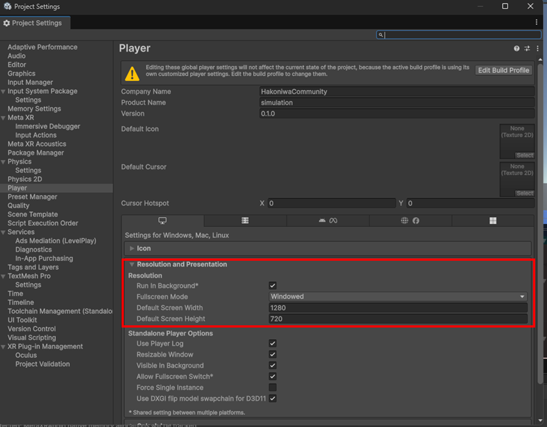
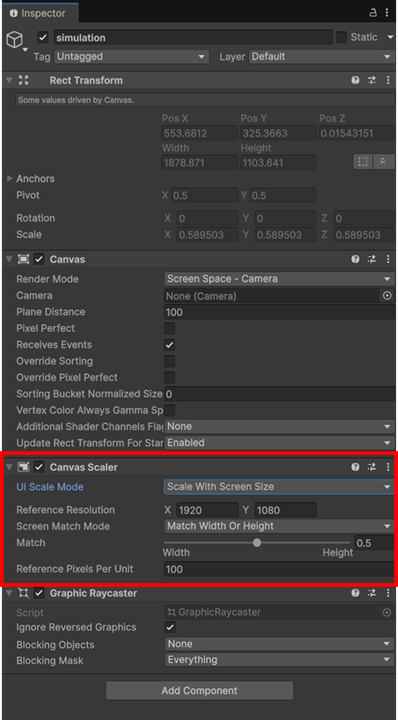

    

    
箱庭ドローンシミュレータ Unity小技1 

    

    

    
ゲーム画面の設定編

    

    

    
箱庭ラボコミュニティ

    

<!-- 改ページ -->

目次

<!-- TOC -->

- [本ドキュメントについて](#本ドキュメントについて)
- [ゲーム画面の考え方](#ゲーム画面の考え方)
- [Unityの設定について](#unityの設定について)
  - [Canvasの設定](#canvasの設定)

<!-- /TOC -->

<!-- 改ページ -->

用語集・改版履歴

|略語|用語|意味|
|:---|:---|:---|
||||

|No|日付|版数|変更種別|変更内容|
|:---|:---|:---|:---|:---|
|1|2026/01/01|0.1|新規|新規作成|
||||||

<!-- 改ページ -->

# 本ドキュメントについて

本ドキュメントは、箱庭ドローンシミュレータでUnityでのゲーム画面を設定する際の設定についての解説となります。

# ゲーム画面の考え方

画面の大きさは、比率があります。いわゆる`アスペクト比`というやつです。Unityのproject settingsで解像度を設定しますが、実際には利用しているコンピュータの画面サイズを考慮する必要があります。
例えば、16:9の`アスペクト比`のPCを利用しているとした場合、X軸、Y軸は、X:Y=16:9となるわけです。この`アスペクト比`に従って、例えばX軸=1024を指定した場合には、Y軸=576のサイズになることになります。以下が計算式の例になります。`アスペクト比`が、4:3や、21:9などありますので、参考にしてください。

# Unityの設定について

Unityでのゲーム画面の設定は、Edit→projects settingsを開き、`Resolution and Presentation`の`Resolution`部分で、Default Screen Width(X軸)、Default Screen Height(Y軸)を設定すると希望したゲーム画面の解像度が設定できます。

しかし、これだけだと希望した解像度が反映されないので、注意が必要です。

## Canvasの設定

ゲームの場合、GUIを配置するのにUnityのアセットであるCanvasを利用することが多いです。Canvasの設定で、Canvas Scale部分で、UI Scale Modeがあります。デフォルトでは、Constant Pixel Sizeとなっているので、動作させるPC画面と、ゲーム画面で設定する解像度が合わなくなります。

Canvas ScaleのUI Scale Modeを`Scale With Screen Size`に設定して、動作させるPC画面のサイズに合わせる必要があります。

こうすることで、実際の画面とゲームで作成する画面を合わせることができるようになります。

- Canvas Scalerの設定値

|パラメータ名|設定値|
|:---|:---|
|UI Scale Mode|Scale With Screen Size|
|Screen Match Mode|Match Width or Height|
|Match|0.5|
|Rederence Pixels Unit|100|