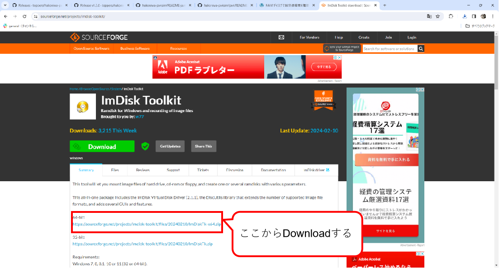
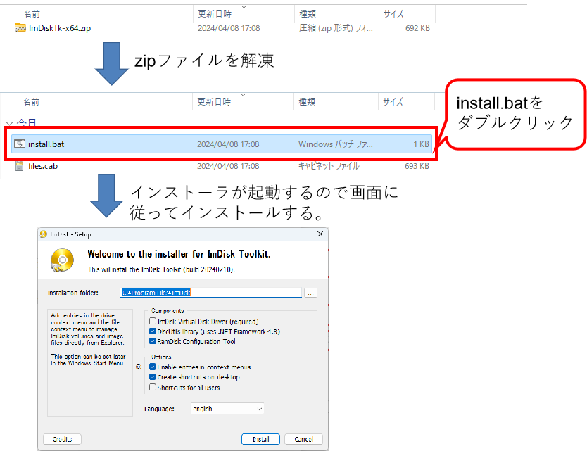
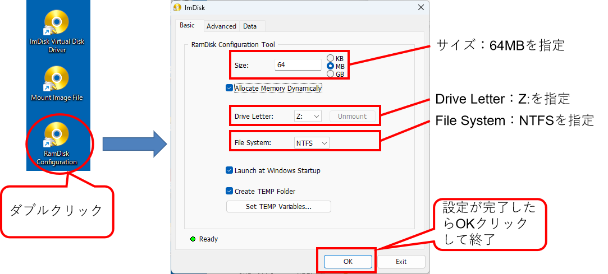
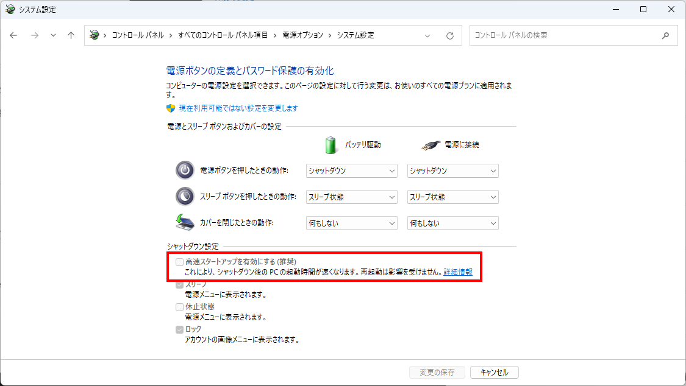
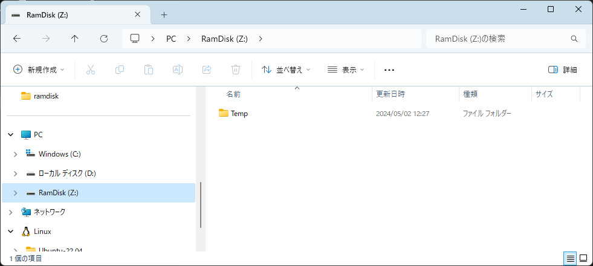
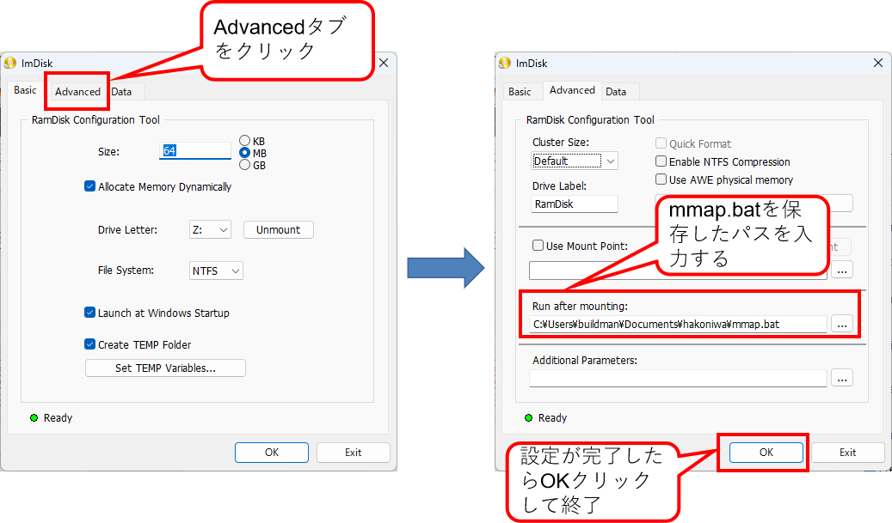

<div class="box-title">
    <p>
    <div style="font-size:18pt;font-weight:bold;text-align:center;margin-top:150px"><span class="title">箱庭ドローンシミュレータ 準備編</span></div>
    </p>
    <p>
    <div style="font-size:14pt;font-weight:bold;text-align:center;margin-top:20px"><span class="sub-title">RAM Diskのインストール</span></div>
    </p>
    <p>
    <div style="font-size:12pt;font-weight:bold;text-align:center;margin-top:500px"><span class="author">ドローンWG</span></div>
    </p>
</div>

<!-- 改ページ -->
<div style="page-break-before:always"></div>

<div style="font-size:18pt;font-weight:bold;text-align:left;"><span class="contents">目次</span></div>

<!-- TOC -->

- [1. 本ドキュメントについて](#1-本ドキュメントについて)
  - [1.1. 対象環境](#11-対象環境)
  - [1.2. 箱庭とは](#12-箱庭とは)
  - [1.3. Windows上での箱庭ドローンシミュレータ動作の要素](#13-windows上での箱庭ドローンシミュレータ動作の要素)
- [2. 各要素のインストール](#2-各要素のインストール)
  - [2.1. WSLの準備](#21-wslの準備)
    - [2.1.1. BIOSの確認](#211-biosの確認)
    - [2.1.2. Windows OS上の設定](#212-windows-os上の設定)
      - [2.1.2.1. WSL導入用の設定](#2121-wsl導入用の設定)
    - [2.1.3. WSL用のLinuxカーネルのインストール](#213-wsl用のlinuxカーネルのインストール)
      - [2.1.3.1. WSL2を既定設定](#2131-wsl2を既定設定)
        - [2.1.3.1.1. WSLの情報](#21311-wslの情報)
    - [2.1.4. WSLで動作させるディストリビューションのインストール](#214-wslで動作させるディストリビューションのインストール)
      - [2.1.4.1. ディストリビューション導入後のパッケージ追加](#2141-ディストリビューション導入後のパッケージ追加)
  - [2.2. Python環境のインストール](#22-python環境のインストール)
  - [2.3. QGC環境のインストール](#23-qgc環境のインストール)
  - [2.4. RAM Disk環境について](#24-ram-disk環境について)
    - [2.4.1. ImDisk Toolkitのインストール](#241-imdisk-toolkitのインストール)
      - [2.4.1.1. 箱庭シミュレータ用の設定](#2411-箱庭シミュレータ用の設定)
  - [2.5. Unity環境について](#25-unity環境について)
    - [2.5.1. Unity環境のダウンロード](#251-unity環境のダウンロード)
    - [2.5.2. Unity Hub環境のインストール](#252-unity-hub環境のインストール)
    - [2.5.3. Unity環境のインストール](#253-unity環境のインストール)
  - [2.6. 各要素のインストール完了](#26-各要素のインストール完了)

<!-- /TOC -->


<!-- 改ページ -->
<div style="page-break-before:always"></div>


<div style="font-size:18pt;font-weight:bold;text-align:left;"><span class="contents">用語集・改版履歴</span></div>


|略語|用語|意味|
|:---|:---|:---|
||||


|No|日付|版数|変更種別|変更内容|
|:---|:---|:---|:---|:---|
|1|2025/09/22|0.1|新規|新規作成|
||||||

<!-- 改ページ -->
<div style="page-break-before:always"></div>

## 2.4. RAM Disk環境について

各要素間で通信でのデータ共有のためにRAM Disk利用しますが、標準のWindows環境ではRAM Diskを作成するためのツールはないため、フリーのツールを導入する必要があります。
Windows用のRAM Disk作成ツールは、さまざまありますが、現状Windows10 or 11で利用制限がないと思われるものを採用することにします。

[Windows用RAM Diskツール比較 参考サイト](https://ik4.es/ja/como-crear-un-disco-ram-en-windows-10-8-y-windows-7/)


ライセンスや使用制限内容などから、今回は「ImDisk」を利用することにします。

### 2.4.1. ImDisk Toolkitのインストール

ImDiskの公式ページにアクセスして、ImDisk環境を入手します。

[ImDisk Toolkit公式ページ(SourceForge)](https://sourceforge.net/projects/imdisk-toolkit/)



ImDisk Toolkitをダウンロードしたら「ImDiskTk-x64.zip」を解凍します。解凍すると「install.bat」があるので、ダブルクリックして、インストーラを起動します。インストーラが起動するとGUIが起動しますので、画面に従って、インストールを行ってください。




インストールが完了すると、ImDisk Toolkit関連のアイコンがディスクトップに出てきますので、「RamDisk Configuration」のアイコンをダブルクリックして、コンフィグレーション画面を起動します。
コンフィグレーション画面が起動したら、以下の設定値を設定して、OKボタンをクリックして終了します。

|No|設定内容|設定値|
|:---|:---|:---|
|1|Size|64MBを指定|
|2|Drive Letter|Z:を指定|
|3|File System|NTFSを指定|




設定が完了すると「Windowsの電源設定」の警告画面が表示されることがあるため以下の電源設定画面にて、高速スタートアップのチェックボックスをOFFにします。完了したら、Windowsを再起動します。




再起動が完了すると以下のようにRamDiskが作成されます。



[ImDiskセットアップ参考サイト：RAM ディスクで超快適環境を構築](https://avalon-studio.work/blog/windows/ram-disk-configration/)

#### 2.4.1.1. 箱庭シミュレータ用の設定

箱庭シミュレータでは、RamDisk上のmmapというフォルダを利用することになります。RamDisk上にmmapフォルダを作成する必要があるのですが、RamDiskの性質上、Windowsを再起動やシャットダウンするとmmapフォルダはなくなってしまいます。
このため、mmapフォルダをWindows起動時にmmapフォルダを作成するようにImDisk Toolkitを設定する必要があります。

「mmap.bat」ファイルを作成します。mmap.batファイルの内容は以下のようになります。

```txt
z:
mkdir mmap
```

mmap.batファイルを作成したら、適当な場所に保存してください。保存ができたら、「RamDisk Configuration」をダブルクリックして起動します。

RamDisk Configurationの画面が起動したら、Advancedのタブをクリックします。Advancedの画面になったら、「Run after mounting」の部分に、先ほど作成したmmap.batを指定します。
完了したらOKボタンをクリックして終了します。

