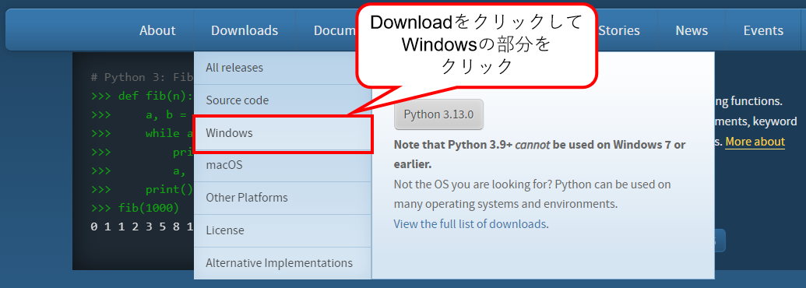
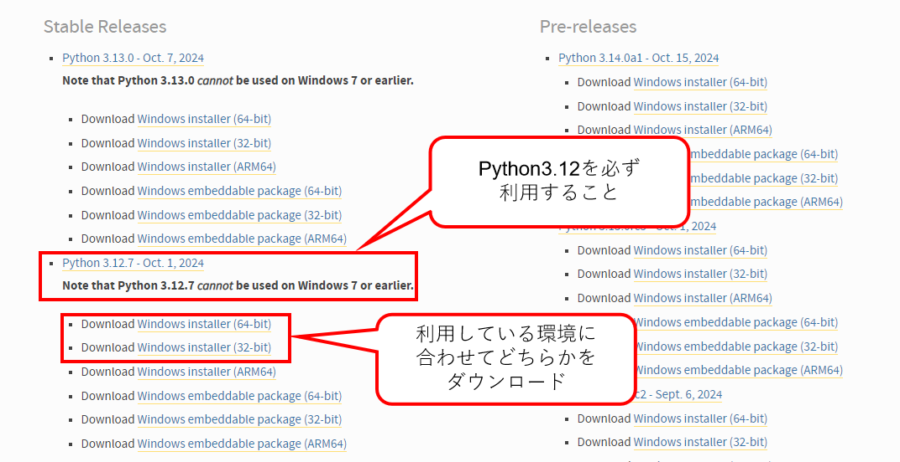
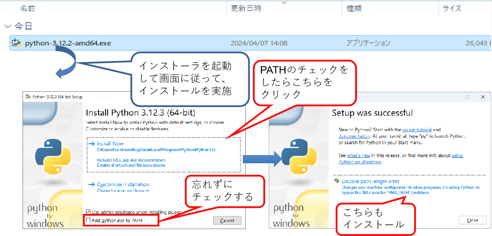

    

    
箱庭ドローンシミュレータ 準備編

    

    

    
Pythonインストール

    

    

    
箱庭ラボコミュニティ

    

<!-- 改ページ -->

目次

<!-- TOC -->

- [1. Python環境のインストール](#1-python環境のインストール)

<!-- /TOC -->

<!-- 改ページ -->

用語集・改版履歴

|略語|用語|意味|
|:---|:---|:---|
||||

|No|日付|版数|変更種別|変更内容|
|:---|:---|:---|:---|:---|
|1|2025/09/22|0.1|新規|新規作成|
||||||

<!-- 改ページ -->

# 1. Python環境のインストール

Pythonの公式ページにアクセスして、PythonをWindowsで動作させる環境を入手します。PythonのVersionは、3.12になります。最新バージョンでは動作しないため注意してください。

[Python公式ページ](https://www.python.org/)

Windows用のPython環境のDownloadページになるので、Python 3.12の環境を選択してダウンロードしてください。

ダウンロードが完了したらインストーラを起動して、画面に従ってインストールをします。

[参考URL：【Windows】Python3.10のインストール(パス通し)](https://qiita.com/youichi_io/items/3111e1cf696a87673b23)