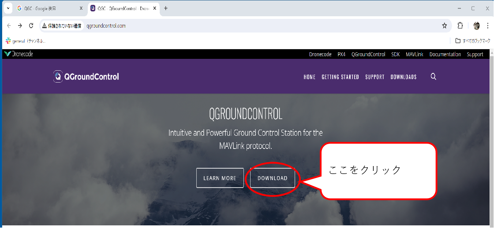
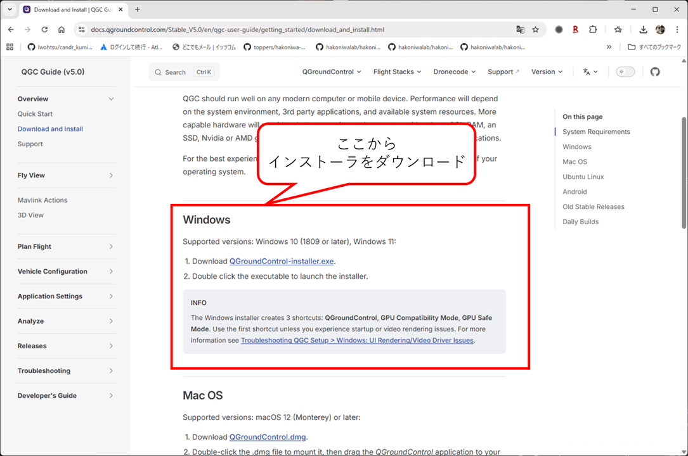
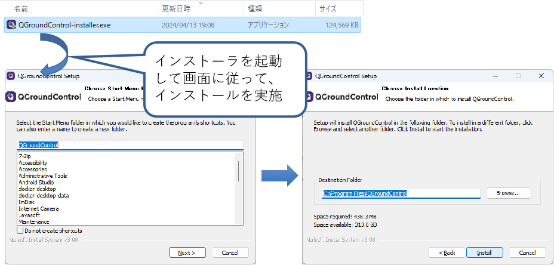

    

    
箱庭ドローンシミュレータ 準備編

    

    

    
Graund Control software(QGC編)インストール

    

    

    
ドローンWG

    

<!-- 改ページ -->

目次

<!-- TOC -->

- [1. QGC環境のインストール](#1-qgc環境のインストール)

<!-- /TOC -->

<!-- 改ページ -->

用語集・改版履歴

|略語|用語|意味|
|:---|:---|:---|
||||

|No|日付|版数|変更種別|変更内容|
|:---|:---|:---|:---|:---|
|1|2025/09/22|0.1|新規|新規作成|
||||||

<!-- 改ページ -->

# 1. QGC環境のインストール

QGC(QGroundControl)の公式ページにアクセスして、QGC環境を入手します。

[QGROUNDCONTOL公式ページ](http://qgroundcontrol.com/)

公式ページに行くと、DOWNLOADというボタンがあるのでクリックします。

DOWNLOADボタンをクリックすると、各OSごとのインストーラが配布されています。Windows用を入手します。

インストーラをダウンロードできたら、インストーラを起動して、画面に従ってインストールします。

