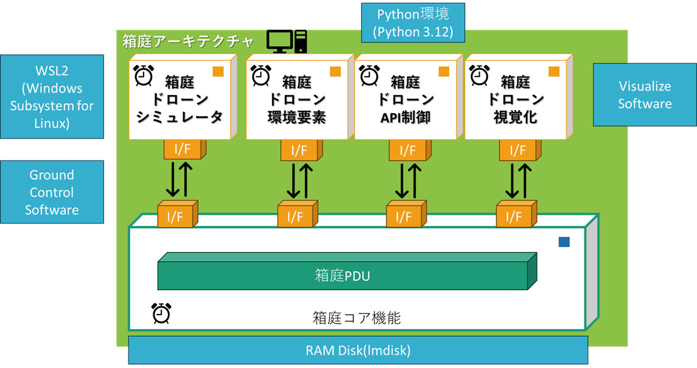

    

    
箱庭ドローンシミュレータ 準備編

    

    

    
Windows環境の利用での事前準備の説明

    

    

    
箱庭ラボコミュニティ

    

<!-- 改ページ -->

目次

<!-- TOC -->

- [1. 本ドキュメントについて](#1-本ドキュメントについて)
  - [1.1. 対象環境](#11-対象環境)
  - [1.2. 箱庭ドローンシミュレータ](#12-箱庭ドローンシミュレータ)
  - [1.3. Windows上での箱庭ドローンシミュレータ必要な環境](#13-windows上での箱庭ドローンシミュレータ必要な環境)

<!-- /TOC -->

<!-- 改ページ -->

用語集・改版履歴

|略語|用語|意味|
|:---|:---|:---|
||||

|No|日付|版数|変更種別|変更内容|
|:---|:---|:---|:---|:---|
|1|2025/09/22|0.1|新規|新規作成|
|||

<!-- 改ページ -->

# 1. 本ドキュメントについて

本ドキュメントは、箱庭ドローンシミュレータが利用する外部ソフトウェア環境を事前にインストールする手順となります。本ドキュメントで解説している部分は、事前にセットアップ済やインストール済みであれば読み飛ばして頂いて問題ありません。また、最初に一度やれば良い手順ですので、一度実施済みであれば、本ドキュメントを読み飛ばして、問題ありません。

## 1.1. 対象環境

本ドキュメントでは、以下のOSバージョンとPC環境を推奨としています。

|No|対象|内容|
|:---|:---|:---|
|1|OS|Windows10 or Windows11|
|2|PC|64bit環境|
|3|PC|Hyper-vが利用できること(推奨)|
|4|PC|Corei7 9th以降|
|5|PC|32Gbyteのメモリ推奨|
|6|PC|SSD 512Gbyte以上|
|7|PC|Graphicsアクセラレータ推奨|

## 1.2. 箱庭ドローンシミュレータ

箱庭ドローンシミュレータは、合同会社 箱庭ラボで開発、運営されているPC上で動作するドローン用のシミュレーションになります。
「箱の中に、さまざまなモノをみんなの好みで配置して、いろいろ試せる！」をコンセプトとして、さまざまな機器やサービスを連携させることでPC上での実証実験に利用できる環境となっています。

[箱庭ドローンシミュレータ紹介(合同会社 箱庭ラボ)](https://hakoniwa-lab.net/products/drone/)

[ドローンスクールラボ様紹介記事](https://drone-school-lab.co.jp/hakoniwa-drone-simulator)

## 1.3. Windows上での箱庭ドローンシミュレータ必要な環境

Windows環境で、箱庭ドローンシミュレータを利用するにあたっては、以下のドローンシミュレーションに必要なソフトウェア環境をインストールが必要になります。

箱庭自体がシミュレータではなく、シミレーションに必要となる各ソフトウェア環境と連携してドローン操縦や操作を実現するような構成になっています。

表．各ソフトウェア環境の説明(上図の青箱部分)

|No|ソフトウェア環境|概要|
|:---|:---|:---|
|1|WSL2(Windows Subsystem for Linux)|ドローン飛行に必要なフライトコントローラのソフトウェアを動作させる環境として利用します。フライトコントローラはPX4、Ardupilotが利用できます。|
|2|Python環境|箱庭シミュレータでPythonでの制御に必要になります。対応バージョンは、3.12のみです。|
|3|Ground Control software|フライトコントローラ(WSL2上で動作)と連携し、ドローン飛行の制御やドローンフライトプランなどに利用します|
|4|RAM Disk環境(lmdisk)|アセット間で通信する際に共有メモリとして利用します|
|5|Visualze Software|ドローンのモデルや飛行状況を投影するのに利用します(ライセンス注意!)現在はUnityとUnreal Engineが利用できます。|