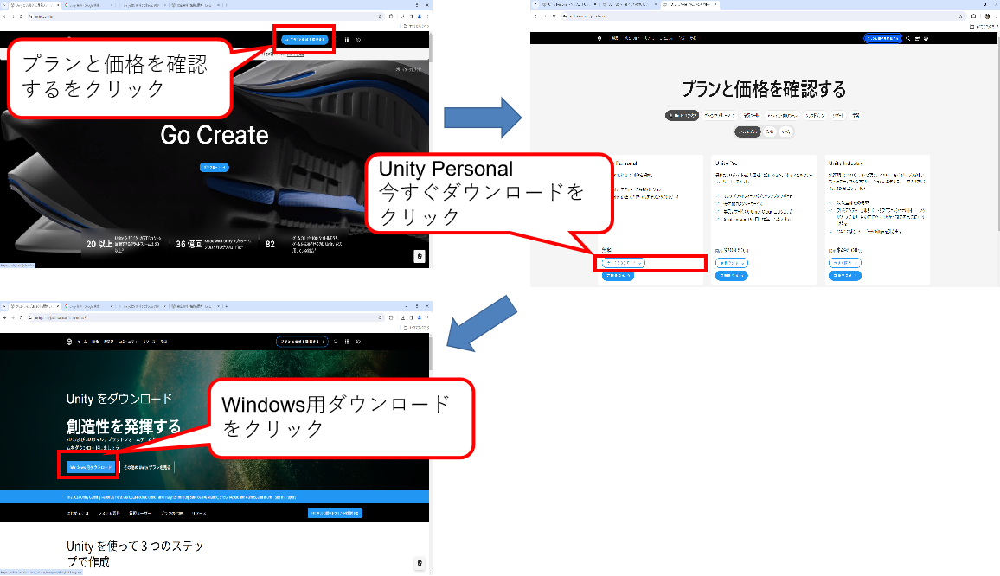
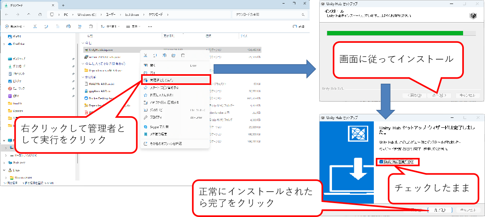
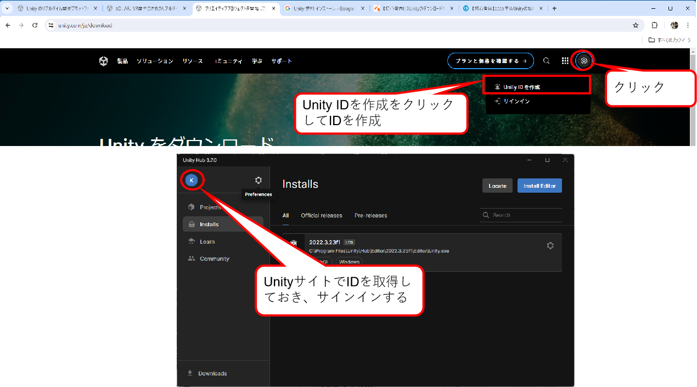
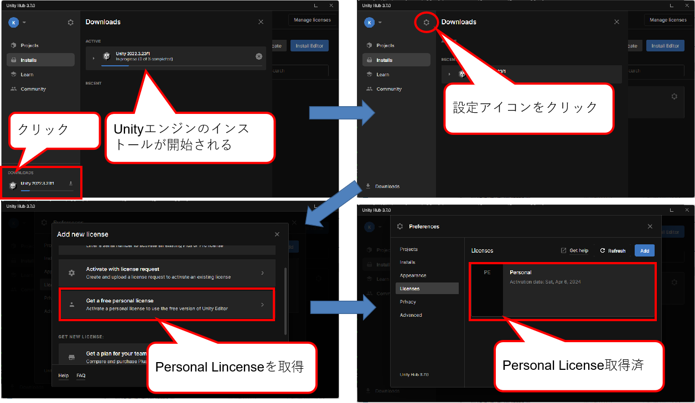
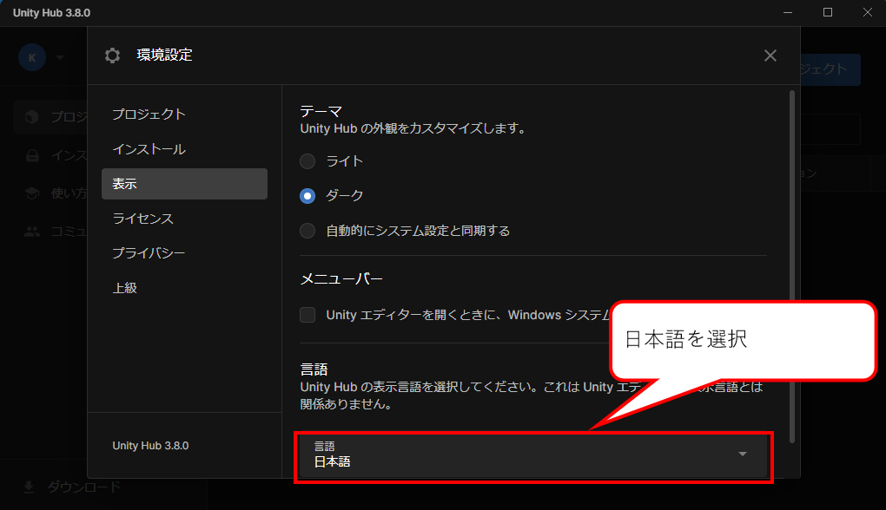

    

    
箱庭ドローンシミュレータ 準備編

    

    

    
Visualze Software(Unity編)インストール

    

    

    
ドローンWG

    

<!-- 改ページ -->

目次

<!-- TOC -->

- [1. Unity環境について](#1-unity環境について)
  - [1.1. Unity環境のダウンロード](#11-unity環境のダウンロード)
  - [1.2. Unity Hub環境のインストール](#12-unity-hub環境のインストール)
  - [1.3. Unity環境のインストール](#13-unity環境のインストール)

<!-- /TOC -->

<!-- 改ページ -->

用語集・改版履歴

|略語|用語|意味|
|:---|:---|:---|
||||

|No|日付|版数|変更種別|変更内容|
|:---|:---|:---|:---|:---|
|1|2025/09/22|0.1|新規|新規作成|
||||||

<!-- 改ページ -->

# 1. Unity環境について

Unity環境は、現時点(2024年05月時点)では、個人利用、学生利用では無料で利用が可能です。しかしながら、商用での利用では有償利用となるため、商用で利用する場合には、正規のライセンスを購入する必要があります。今回の箱庭シミュレータでのUnity利用は、あくまでも個人利用且つ、教育用途として利用することを想定していますので、決して商用での利用はしないようにしてください。また、Unity環境の利用規約も変わる可能性がありますので、留意してください。

[Unityのインストール参考サイト：【初心者用】2023年版Unityの始め方！インストールから勉強方法まで解説](https://yuru-uni.com/unity-start2023/)

## 1.1. Unity環境のダウンロード

Unityの公式ページにアクセスして、Unity環境を入手します。

[Unity公式ページ](https://unity.com/ja)

Unityの公式ページの右上にある「プランと価格を確認する」となっているボタンをクリックします。クリックすると、Uinity環境の利用プランと価格が表示されます。今回は、「Unity Personal」のプランを利用するので、Unity Personalの「今すぐダウンロード」部分をクリックします。クリックすると「Windows用のダウンロード」のボタンがありますので、クリックしてダウンロードを行ってっください。

## 1.2. Unity Hub環境のインストール

ダウンロードができたら、「UnityHubSetup.exe」を右クリックして、管理者として実行をクリックします。Unity Hub セットアップのインストール画面が起動するので、画面に従ってインストールします。インストールが完了すると”Unity Hubセットアップウィザードは完了しました”と表示されます。このとき、Unity Hubを実行(R)のチェックボックスは、そのままにしておき、完了ボタンをクリックします。

## 1.3. Unity環境のインストール

Unity Hub環境がインストールされたら、Unity Hubが起動されます。Unity HubにUnityエンジンをインストールする必要がありますが、インストールする際には、Unity公式ページにてUnity IDを作成する必要があります。Unity公式ページで、Unity IDを作成したのち、Unity Hubの左上のアイコンをクリックして、Unity IDでサインインしておきます。

サインインができたら、左下のDownloadをクリックして、利用可能なUnityエンジンをDownloadします。ダウンロードが完了したら、設定アイコンをクリックしてLincenseをクリックします。「Add new license」が表示されるので、Get a free personal licenseをクリックして、Personalライセンスを取得します。取得後、Personal Lincenseが取得されたことが確認できます。

Unityでは、日本語の利用が可能です。設定アイコンをクリックして、Appearanceをクリックし、Languageの部分を日本語に選択します。

