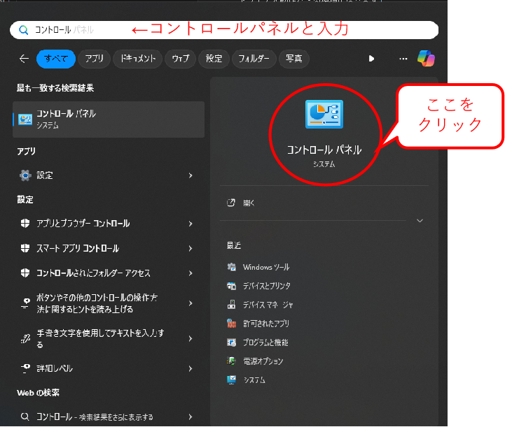
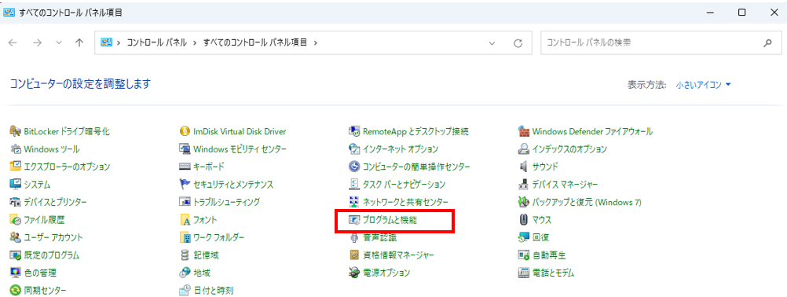
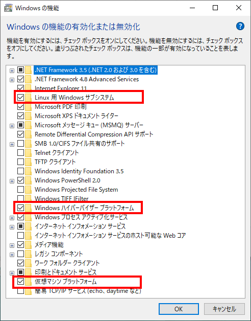
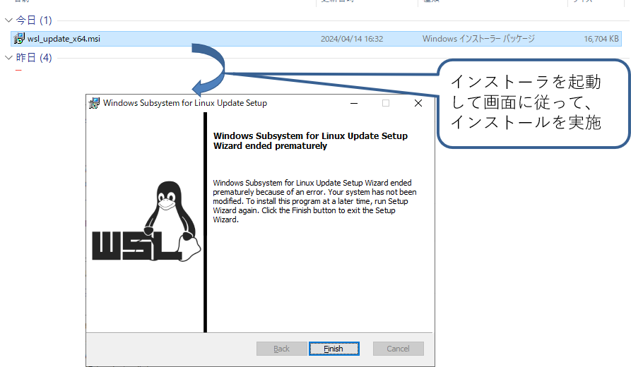
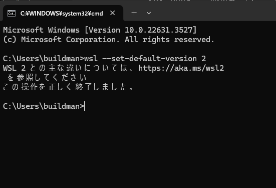
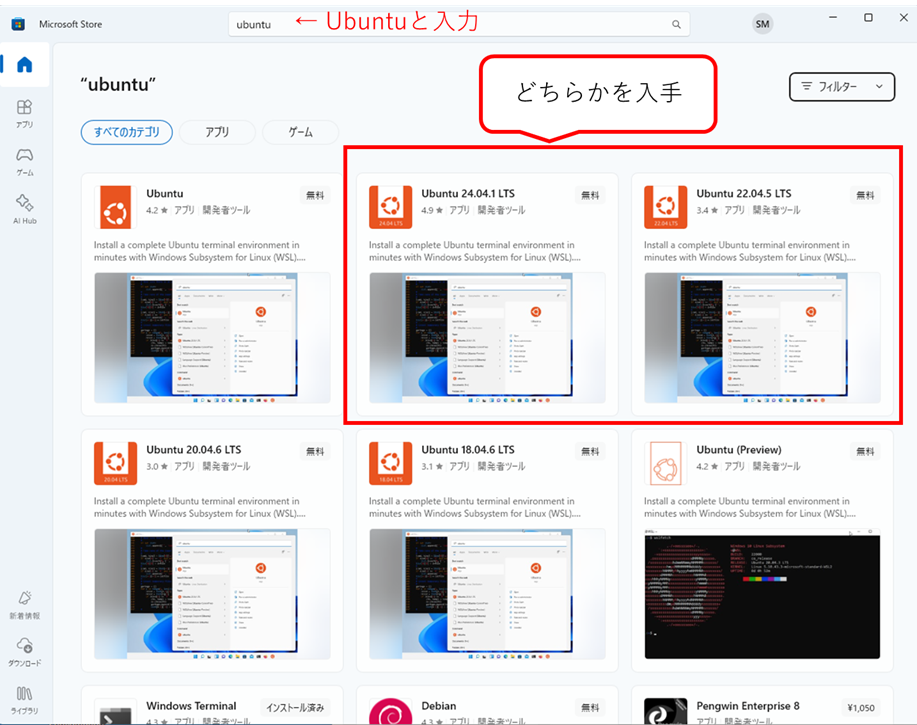
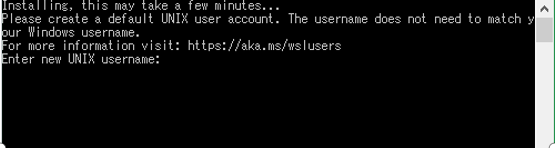

<div class="box-title">
    <p>
    <div style="font-size:18pt;font-weight:bold;text-align:center;margin-top:150px"><span class="title">箱庭ドローンシミュレータ 準備編</span></div>
    </p>
    <p>
    <div style="font-size:14pt;font-weight:bold;text-align:center;margin-top:20px"><span class="sub-title">WSL2のインストール</span></div>
    </p>
    <p>
    <div style="font-size:12pt;font-weight:bold;text-align:center;margin-top:500px"><span class="author">箱庭ラボコミュニティ</span></div>
    </p>
</div>

<!-- 改ページ -->
<div style="page-break-before:always"></div>

<div style="font-size:18pt;font-weight:bold;text-align:left;"><span class="contents">目次</span></div>

<!-- TOC -->

- [本ドキュメントについて](#本ドキュメントについて)
  - [WSLのインストールの簡易版](#wslのインストールの簡易版)
    - [WSLのVersionの確認](#wslのversionの確認)
  - [1. WSLインストールの詳細](#1-wslインストールの詳細)
    - [1.1. BIOSの確認](#11-biosの確認)
    - [1.2. Windows OS上の設定](#12-windows-os上の設定)
      - [1.2.1. WSL導入用の設定](#121-wsl導入用の設定)
    - [1.3. WSL用のLinuxカーネルのインストール](#13-wsl用のlinuxカーネルのインストール)
      - [1.3.1. WSL2を既定設定](#131-wsl2を既定設定)
        - [1.3.1.1. WSLの情報](#1311-wslの情報)
    - [1.4. WSLで動作させるディストリビューションのインストール](#14-wslで動作させるディストリビューションのインストール)
      - [1.4.1. ディストリビューション導入後のパッケージ追加](#141-ディストリビューション導入後のパッケージ追加)

<!-- /TOC -->


<!-- 改ページ -->
<div style="page-break-before:always"></div>


<div style="font-size:18pt;font-weight:bold;text-align:left;"><span class="contents">用語集・改版履歴</span></div>


|略語|用語|意味|
|:---|:---|:---|
||||


|No|日付|版数|変更種別|変更内容|
|:---|:---|:---|:---|:---|
|1|2025/09/22|0.1|新規|新規作成|
||||||

<!-- 改ページ -->
<div style="page-break-before:always"></div>

# 本ドキュメントについて

本手順は、箱庭ドローンシミュレータの`PX4 フライトコントローラ`、`Ardupilotフライトコントローラ`


## WSLのインストールの簡易版

BIOSの仮想化機能が有効になっていれば、wslのインストールは`Powershell`で簡易的にインストールができます。もし、できない場合には、**WSLインストールの詳細**の部分を読みながらインストールをしてください。

```powershell
wsl --install
```
or
```powershell
wsl --install -d `Distribution Name`
```

`Distribution Name`の部分は、`wsl --list --online`で確認したものを指定できます。

### WSLのVersionの確認

WSLのインストールができたら、WSLのVersionを確認しましょう。

```powershell
wsl -l -v
```

```txt
  NAME      STATE           VERSION
* Ubuntu    Running         2
```

もし、VERSIONが`2`になっていない場合は、以下の設定を実施してください。

```powershell
wsl --set-default-version 2
```


## 1. WSLインストールの詳細

インターネット上で検索すれば、インストール方法は出てきますが、ここではポイントを絞ってインストール方法を解説します。

以下のサイトを参考にインストールできると思います。また、WSL2自体の説明もありますので参考にしてください。


[参考サイト1：WSL2 のインストール，WSL2 上への Ubuntu のインストールと利用（Windows 11 対応の記事）（Windows 上）](https://www.kkaneko.jp/tools/wsl/wsl2.html)

[参考サイト2：WindowsでWSL2を使って「完全なLinux」環境を作ろう！](https://www.kagoya.jp/howto/it-glossary/develop/wsl2_linux/)

### 1.1. BIOSの確認

各PC上のBIOS画面を開いて、Hyper-v機能が利用できる場合は、有効化してください。

### 1.2. Windows OS上の設定

Windowsマークのスタートボタン → Windowsシステムツール → コントロールパネルをクリックして開きます。(Windows10)もしくは、Windowsマークをクリックして、検索ウィンドでコントールパネルと入力して開きます。(Windows11)



コントロールパネルが開いたら「プログラムと機能」を開きます。



「プログラムと機能」が開いたら、左側にある「Windowsの機能の有効化または無効化」を開きます。


#### 1.2.1. WSL導入用の設定

「Windowsの機能の有効化または無効化」が開いたら、「Linux用Windowsサブシステム」「Windowsハイパーバイザープラットフォーム(もしあれば)」「仮想マシンプラットフォーム」をそれぞれチェックマークを入れます。



チェックマークが入れられたら、一旦、再起動します。再起動時にWSL2の動作に必要なWindowsの機能が導入されます。


### 1.3. WSL用のLinuxカーネルのインストール

以下のサイトにアクセスして、WSL2上で動作するLinuxカーネルイメージを更新します。

[WSL用Linuxカーネルイメージ入手先](https://learn.microsoft.com/ja-jp/windows/wsl/install-manual#step-4---download-the-linux-kernel-update-package)

サイトにアクセスすると、WSL2用のLinuxカーネルを入手できるサイトにリンクがあるので、クリックしてダウンロードをします。


ダウンロードが終わったら、インストーラを起動して、画面に従って、インストールを実施します。インストールが終わったら再起動します。



#### 1.3.1. WSL2を既定設定

「Windowsキー」＋「R」を押下して、「ファイル名を指定して実行」を開き、「cmd」と入力してコマンドプロンプトを表示させます。

コマンドプロンプトが開いたら、以下のコマンドを入力してWSLの既定値をWSL2に設定します。

```cmd
c:\User\”ユーザ名”> wsl --set-default-version 2
```

コマンド実行後、”この操作は正しく終了しました。”と表示されれば設定完了です。コマンドプロンプトを閉じてください。



##### 1.3.1.1. WSLの情報

ここまでの手順でWSLは導入されたことになります。WSLには、Version1とVersion2が存在します。Version1をWSL1、Version2をWSL2と呼んでおり、WSL2の方がよりネイティブのLinux環境に近い環境になっています。

WSLの導入にあたっては、Microsoftが公式にチュートリアルを用意していますので、トラブルや導入方法が分からない場合には、参照してください。

[Windows Subsystem for Linux に関するドキュメント(Microsoft公式)](https://learn.microsoft.com/ja-jp/windows/wsl/)

### 1.4. WSLで動作させるディストリビューションのインストール

WSL上で動作させるためのLinuxディストリビューションをインストールします。今回の箱庭シミュレータでは、Ubuntu22.04を導入します。

Windowsスタートボタンをクリックして、「Microsoft Store」を開きます。


開いたら、検索部分にUbuntuと入力して、Enterを入力すると、Ubuntuの入手画面が開きますので、Ubuntu 22.04をクリックして、開くをクリックするとインストールが開始されますので、インストールが完了するまで、しばらく待ってください。



インストールが完了すると、Ubuntuの初期化画面が表示され、「Enter new UNIX username」が聞かれます。その後、usernemaのパスワードが聞かれますので、適時設定してください。



#### 1.4.1. ディストリビューション導入後のパッケージ追加

箱庭ドローンシミュレータを動作させる場合に、IPアドレスの確認が必要になります。ディストリビューションのインストール、usernameとpassword設定が完了したら、追加のパッケージをインストールしておきます。ディストリビューションのUbuntuを起動して、以下のコマンドを実行しておいてください。

```bash
sudo apt-get install net-tools
```