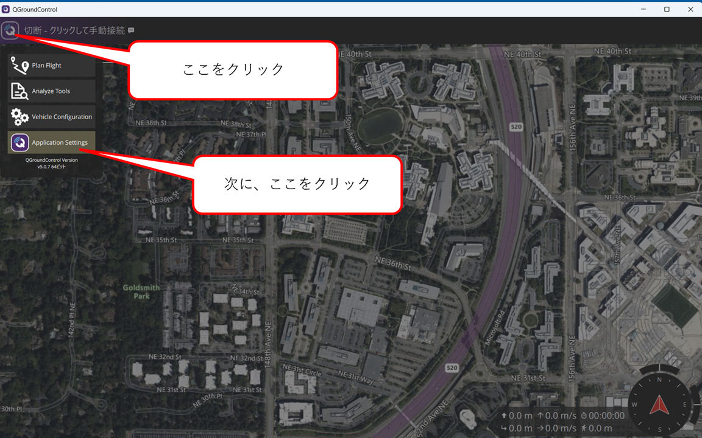
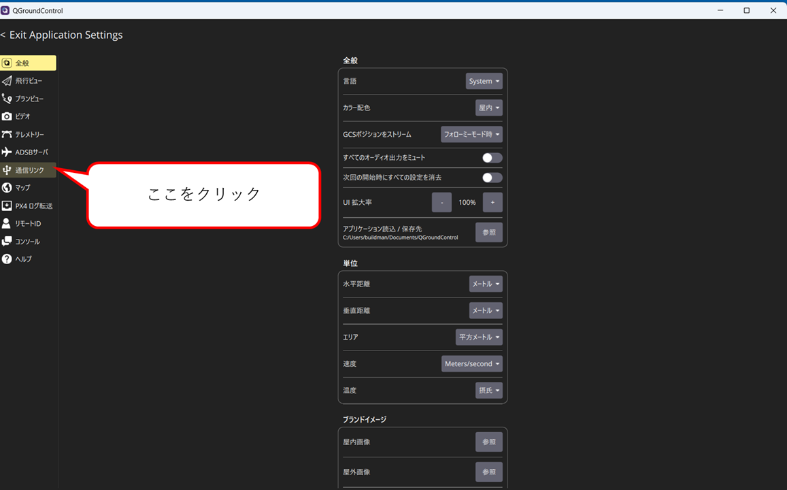
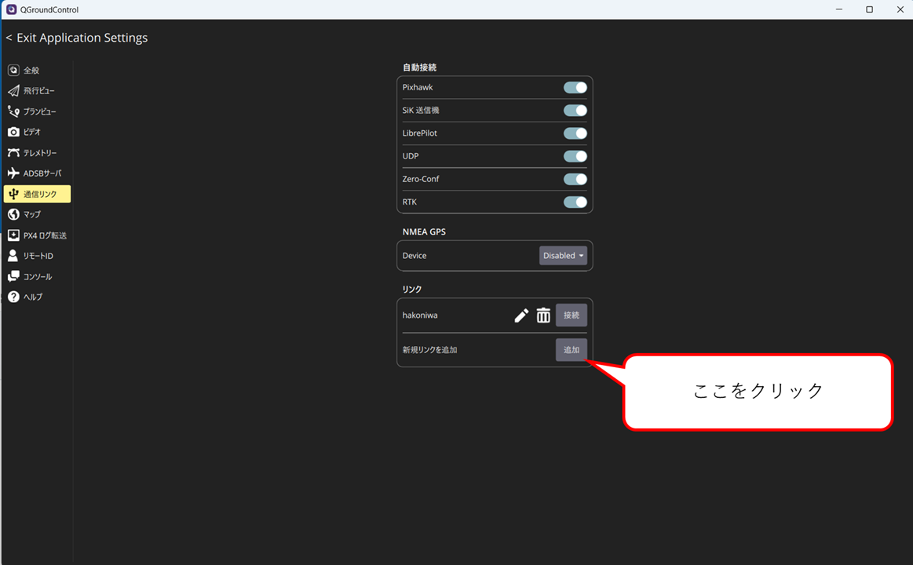
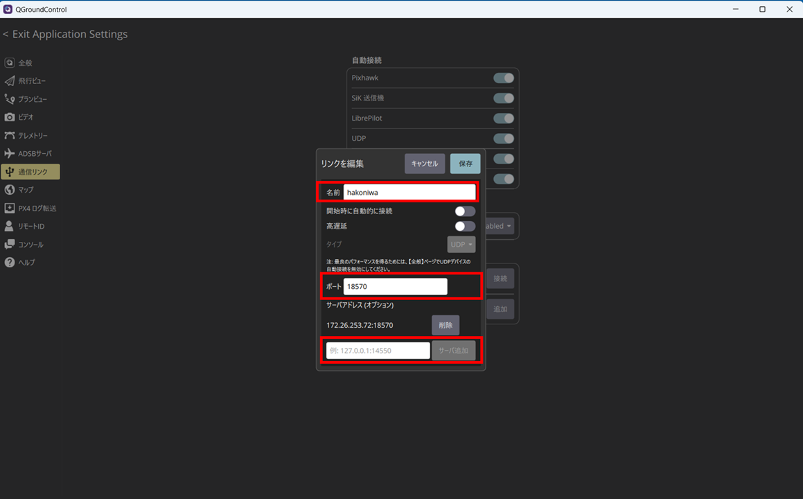
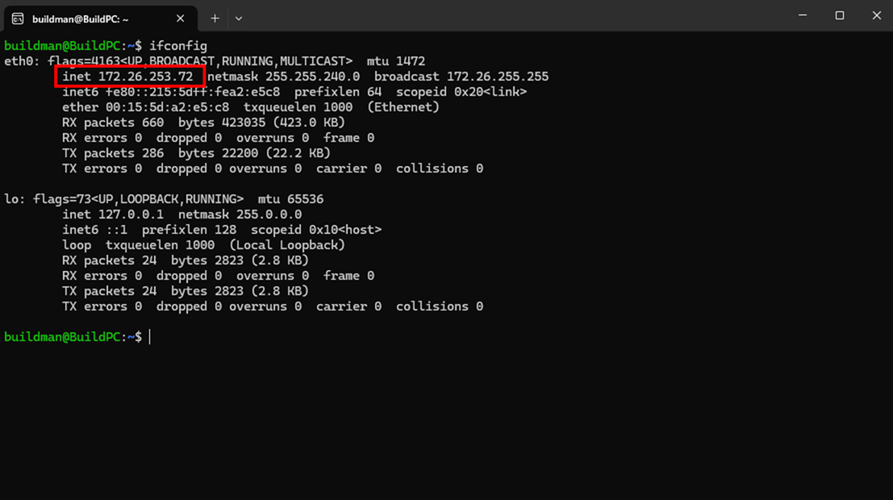

<div class="box-title">
    <p>
    <div style="font-size:18pt;font-weight:bold;text-align:center;margin-top:150px"><span class="title">箱庭ドローンシミュレータ 準備編</span></div>
    </p>
    <p>
    <div style="font-size:14pt;font-weight:bold;text-align:center;margin-top:20px"><span class="sub-title">QGCの設定方法</span></div>
    </p>
    <p>
    <div style="font-size:12pt;font-weight:bold;text-align:center;margin-top:500px"><span class="author">箱庭ラボコミュニティ</span></div>
    </p>
</div>

<!-- 改ページ -->
<div style="page-break-before:always"></div>

<div style="font-size:18pt;font-weight:bold;text-align:left;"><span class="contents">目次</span></div>

<!-- TOC -->

- [1. QGCの通信リンクの設定](#1-qgcの通信リンクの設定)
  - [1.1. QGCの起動](#11-qgcの起動)
    - [1.1.1. Application Settingの設定](#111-application-settingの設定)
      - [1.1.1.1. WSL2のIPアドレスの確認について](#1111-wsl2のipアドレスの確認について)

<!-- /TOC -->


<!-- 改ページ -->
<div style="page-break-before:always"></div>


<div style="font-size:18pt;font-weight:bold;text-align:left;"><span class="contents">用語集・改版履歴</span></div>


|略語|用語|意味|
|:---|:---|:---|
||||


|No|日付|版数|変更種別|変更内容|
|:---|:---|:---|:---|:---|
|1|2025/09/22|0.1|新規|新規作成|
|||

<!-- 改ページ -->
<div style="page-break-before:always"></div>

# 1. QGCの通信リンクの設定

WSL2上で動作するPX4との通信を行うため、QGC側の通信リンクの設定を行います。

## 1.1. QGCの起動

インストールしたQGCを起動します。起動すると地図画面が表示されますので、左上のをクリックします。

クリックすると、メニューが表示されるので、一番下のApplication Settingをクリックします。



### 1.1.1. Application Settingの設定

Application Settingをクリックすると、各種QGCの設定をするためのメニューが左側に表示されます。
**通信リンク** となっているメニューをクリックします。



通信リンクをクリックすると、`自動接続`、`NMEA GPS`、`リンク`の設定が表示されるので、`リンク`部分の`新規リンクを追加`の**追加**ボタンをクリックします。



追加ボタンをクリックすると、`名前`、`ポート`、`サーバ追加`の設定画面が表示されるので、それぞれを設定します。設定が完了したら、**保存**をクリックして設定内容を保存しておきます。



|メニュー名|設定内容|
|:---|:---|
|名前|hakoniwa|
|ポート|18570|
|サーバ追加|WSL2のIPアドレス|

#### 1.1.1.1. WSL2のIPアドレスの確認について

インストールしたWSL2環境を起動して、`ifconfig`コマンドでIPアドレスを確認します。

表示されたIPアドレスをQGCのサーバ追加に設定します。



`ifconfig`コマンドが使えない場合には、**net-tools**パッケージをインストールしましょう。

```bash
sudo apt install net-tools
```