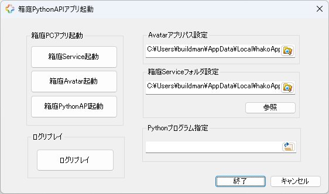
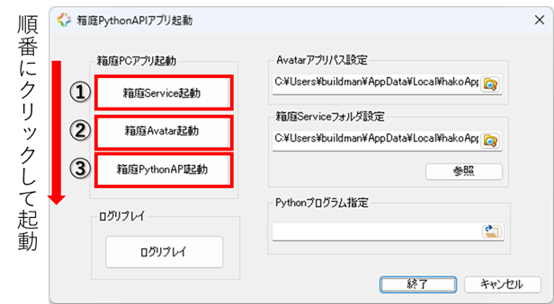

# 箱庭ドローンシミュレータ Python API操作方法

このドキュメントは、箱庭ドローンシミュレータ Python API操作のアプリケーションの操作説明となります。

## インストール方法

箱庭ドローンシミュレータのアプリケーション用のインストーラにてWindows PCにインストールします。

[インストーラの手順](../wininstall-doc/appsinstall.md)

## 起動方法

インストーラにてインストールすると、ディスクトップ上に`hakoApps-win`のフォルダが作成されます。`hakoApps-win`フォルダをダブルクリックすると、hakoWinAppsAPIフォルダ、hakoWinAppsRCフォルダ、インストールフォルダを開くのショートカットが表示されます。

`hakoWinAppsAPIフォルダ`をダブルクリックすると、hakoWinAppsAPI.exeが表示されるので、`hakoWinAppsAPI.exe`をダブルクリックします。

### 基本操作

起動するとダイアログベースのアプリケーションが起動します。`箱庭Service起動`ボタン→`箱庭Avatar起動`ボタン、`箱庭PythonAPI起動`ボタンを順にクリックします。

`箱庭Service起動`ボタンをクリックするとPowershell画面にて箱庭ドローンシミュレータが起動されます。

`箱庭Avatar起動`ボタンをクリックするとUnity版のビジュアライズ画面が表示されます。Unityアプリケーションの`START`ボタンをクリックします。`START`ボタンをクリックすると箱庭ドローンシミュレータが開始されます。

`箱庭PythonAPI起動`ボタンをクリックするとサンプルアプリのPythonがPowershellで起動されます。サンプルアプリが開始されると、UnityアプリケーションでPython APIを使ったドローン飛行の体験ができます。

### カスタム操作

自作したPython API

## 箱庭ドローンシミュレータ Pytho APIを使ったカリキュラム

[箱庭ドローンシミュレータPYTHON API教育編](https://www.docswell.com/slide/544X1D/edit)を公開しています。参考にしてください。