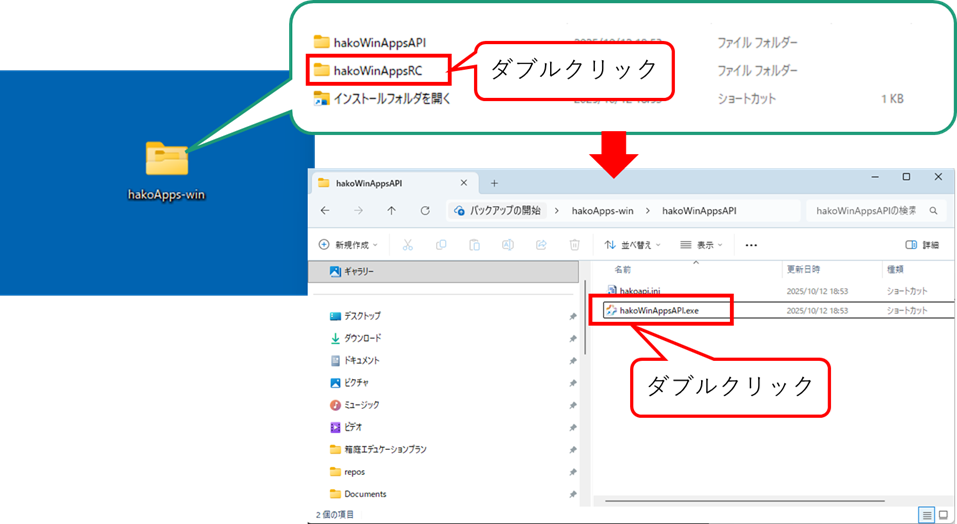
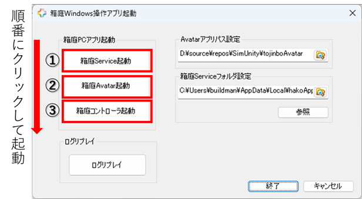
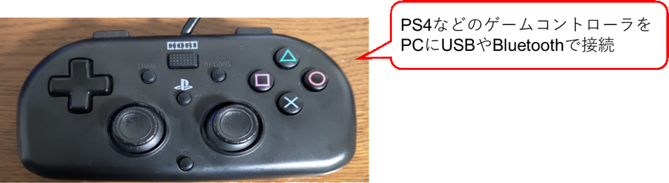
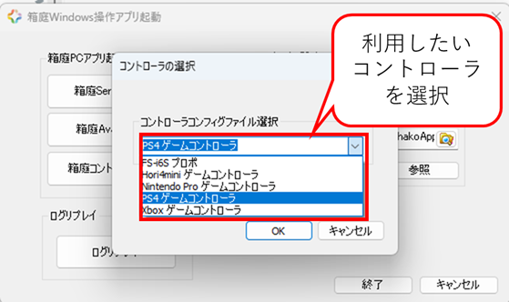
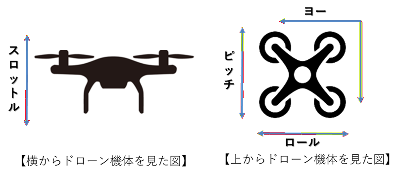
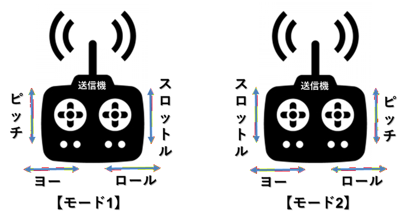
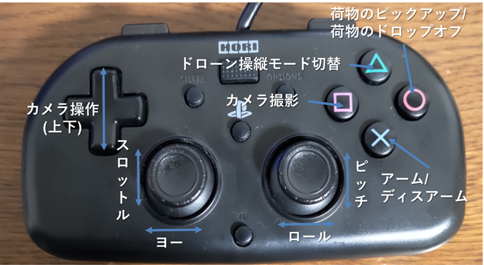

# 1. 箱庭ドローンシミュレータ hakoWinAppsRC.exe 操作方法

このドキュメントは、箱庭ドローンシミュレータ RC操作のアプリケーションの操作説明となります。

## 1.1. インストール方法

箱庭ドローンシミュレータのアプリケーション用のインストーラにてWindows PCにインストールします。

[インストーラの手順](../wininstall-doc/appsinstall.md)

## 1.2. 起動方法

インストーラにてインストールすると、ディスクトップ上に`hakoApps-win`のフォルダが作成されます。`hakoApps-win`フォルダをダブルクリックすると、hakoWinAppsAPIフォルダ、hakoWinAppsRCフォルダ、インストールフォルダを開くのショートカットが表示されます。

`hakoWinAppsRCフォルダ`をダブルクリックすると、hakoWinAppsRC.exeが表示されるので、`hakoWinAppsRC.exe`をダブルクリックします。

### 1.2.1. 基本操作

起動するとダイアログベースのアプリケーションが起動します。`箱庭Service起動`ボタン→`箱庭Avatar起動`ボタン、`箱庭コントローラ起動`ボタンを順にクリックします。

`箱庭コントローラ起動`ボタンをクリックする前にゲームコントローラをUSB or BluetoothでPCに接続しておきます。

現在のアプリでは、以下のコントローラがサポートされています。

|ゲームパッド名|
|:---|
|PS4ゲームコントローラ|
|xboxゲームコントローラ|
|Nintendo Proゲームコントローラ|
|Hori4miniゲームコントローラ|

`箱庭Service起動`ボタンをクリックするとPowershell画面にて箱庭ドローンシミュレータが起動されます。

`箱庭Avatar起動`ボタンをクリックするとUnity版のビジュアライズ画面が表示されます。Unityアプリケーションの`START`ボタンをクリックします。`START`ボタンをクリックすると箱庭ドローンシミュレータが開始されます。

`箱庭コントローラ起動`ボタンをクリックし、利用するゲームコントローラを選択してOKをクリックします。OKをクリックするとゲームパッド用のpythonがpowershellで起動されます。
起動後、ゲームコントローラで操作ができるようになります。

## 1.3. ドローンの操縦について

ここでは、実際のドローンの機体動作や、送信機の操作方法を解説します。

### 1.3.1. ドローン機体の動作

ドローンの機体の動作は、以下のような定義になっています。

|No|用語|内容|
|:---|:---|:---|
|1|スロットル|ドローン機体の上昇と下降操作|
|2|ロール(エルロン)|ドローン機体の左右移動操作|
|3|ピッチ(エレベータ)|ドローン機体の前進と後進操作|
|4|ヨー(ラダー)|ドローン機体の左右旋回操作|

### 1.3.2. 送信機(プロポ)の操作

ドローンの機体操作は、送信機(プロポ)と言われるラジコンで使われる機器で操作をします。送信機には、モード定義があり、ドローン機体の動作に合わせた操作を送信機上のスティックで操作します。

送信機の操作モードをモード2として取り扱う定義となっています。

### 1.3.3. ドローン機体操作

PS4コントローラなどのゲームパッドを使って、ドローンの飛行を操作することができます。また、Avatar画面に配置されている荷物の搬送や、ドローン搭載されているカメラでの撮影ができるようになっています。

#### 1.3.3.1. PS4コントローラの操作定義

Pythonシミュレータでは、ドローンの機体をPS4コントローラで操作します。例としてPS4コントローラの操作方法は、以下のような定義になっています。

|No|例：PS4コントローラ|内容|備考|
|:---|:---|:---|:---|
|1|左側Joy Stick|スロットルとヨーの操作をします||
|2|右側Joy Stick|ピッチとロールの操作をします||
|3|×ボタン|アーム/ディスアームをします|アームはプロペラ回転開始/ディスアームはプロペラ回転停止のこと|
|4|□ボタン|カメラを使った撮影を操作します||
|5|○ボタン|Pythonシミュレータ上に配置されている荷物のピックアップ/ドロップオフを操作します|
|6|十字キー/上下|カメラの向きを上下に操作します。|

