# 1. 前提条件

箱庭アプリをインストールするには、箱庭コア機能、lmdisk、Python 3.12のインストールが終わっていることが条件となります。

以下のドキュメントを参照して、事前にインストールしておいてください。

[箱庭コア機能のインストール手順](https://github.com/buildko89/documents/blob/main/hakodoc/wininstall-doc/coreinstall.md)

lmdisk、Ptython 3.12は箱庭コア機能のインストール時にインストールが済んでいるなら以下の手順は不要になります。

[lmdiskインストール手順](https://github.com/buildko89/documents/blob/main/hakodoc/preinstall-doc/lmdisk_install.md)

[Python3.12インストール手順](https://github.com/buildko89/documents/blob/main/hakodoc/preinstall-doc/python_install.md)

# 2. 箱庭アプリインストーラのダウンロード

箱庭ドローンシミュレータに必要な`箱庭アプリ`をインストールするためのインストーラを入手します。以下のリリースページに`hakoApps-win_vx.x.x.zip`で配布されています。

[箱庭アプリインストーラの場所](https://github.com/buildko89/hakowin/releases/download/v1.0.2/hakoApps-win_v1.0.2.zip)

# 3. 箱庭アプリのインストール

`hakoApps-win_vx.x.x.zip`をダウンロードしたら、zipファイルを解凍します。解凍すると、`setup.exe`、`hakowin-msi`が解凍されます。

`setup.exe`を右クリックして、管理者として実行をクリックして実行します。

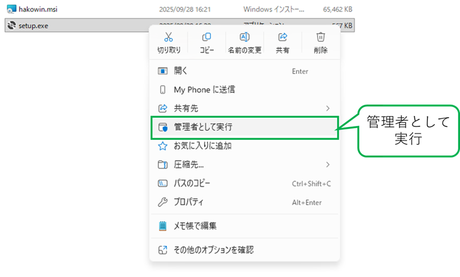

管理者モードで実行するか？と聞かれるのでOKをクリックしてインストールを実行してください。

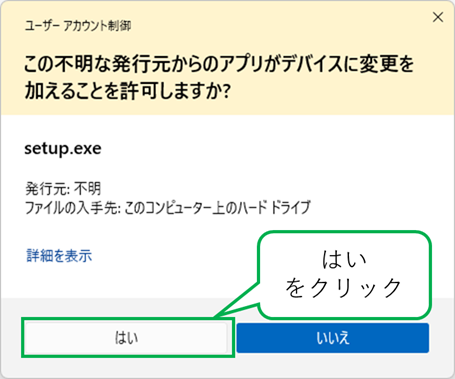

インストール画面が表示されるので、次へ(N)>をクリックして次の画面に進みます。

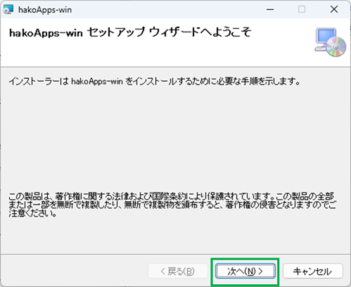

インストール フォルダの選択画面が表示されます。インストール先はデフォルトでは`C:¥User¥<ユーザ名>¥AppData¥Local¥`になります。次へ(N)>をクリックして次の画面に進みます。

インストーラ先のフォルダの変更が必要な場合は変更して、次へ(N)>をクリックして次の画面に進みます。

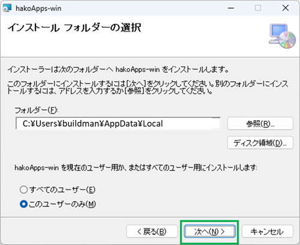

⚠️インストール フォルダの選択について
Windows環境でOneDriveが設定されている場合には注意が必要です。OneDriveのバックアップ対象のフォルダ(例：Desktop,Documentsなど)を選択するとOneDriveにリダイレクトされるので注意してください。

インストールの確認画面がが出ますので、次へ(N)>をクリックして次の画面に進みます。

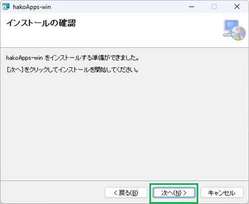

インストールが始まりますので、しばらく待ちます。

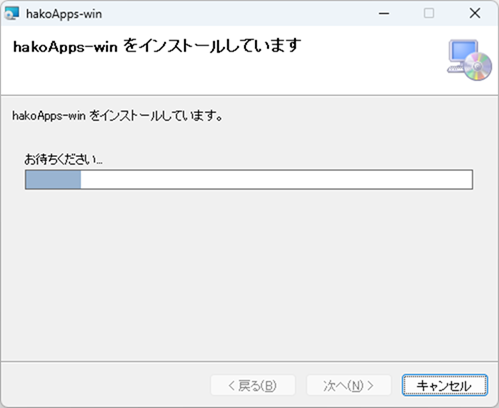

インストールが完了するとインストール完了の画面が表示されますので、閉じるをクリックしてインストールを完了します。

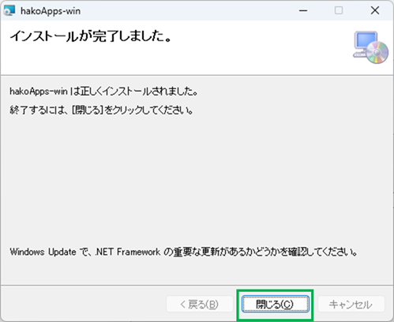

インストールが完了するとデスクトップ上にhakoApps-winのフォルダが作成されますので、フォルダをクリックして内容を確認してください。

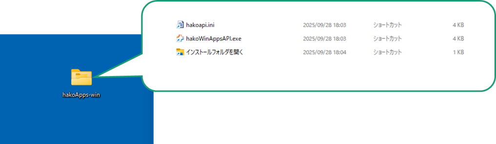

# 4. トラブルシューティング

インストーラを使った箱庭ドローンシミュレータ動作環境では、いくつかのトラブルが発生する可能性があります。以下のようなトラブルになった場合には、環境を見直してください。

## 4.1. 環境変数が設定できていない場合

管理者権限でのインストールをしていない場合には、Windows側のシステム上、環境変数が設定されません。環境変数が設定できていないと、以下のようなエラーが発生する場合があります。

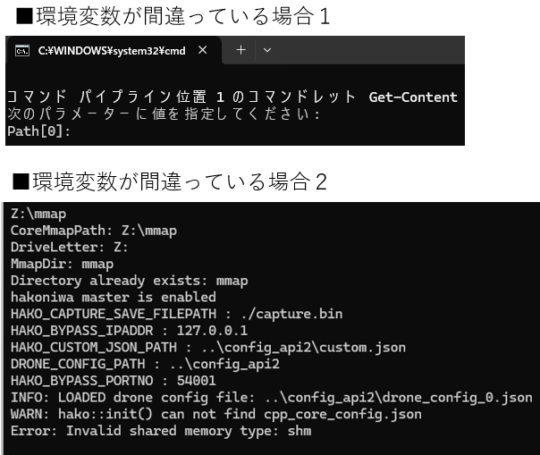

この場合は、箱庭ドローンシミュレータのインストーラが管理者権限で実行されてないために置きますので、一度、アンインストールして、管理者権限で再度インストールし直してください。

## 4.2. RAM Diskが設定できてない場合

RAM Diskが正しく設定できていない場合、以下のようなエラーが発生する場合があります。

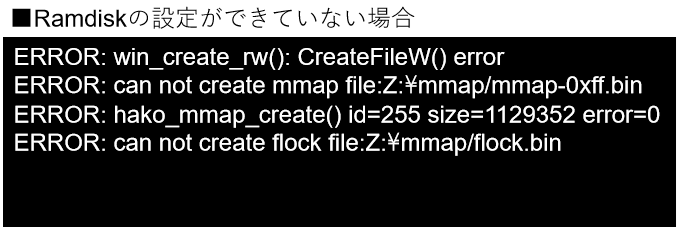

この場合、RAM Diskの設定を見直すため、 [1.2.1. RAM Disk環境について](#121-RAM-Disk環境について)の手順を良く見直して、設定を確認してください。

## 4.3. PythonのVersionが3.12となってない場合

Python Versionが3.12となっていない場合、以下のようなエラーが発生する場合があります。箱庭ドローンシミュレータでのPython利用は、Version 3.12が前提となっていますので、Version 3.12を利用するようにしてください。

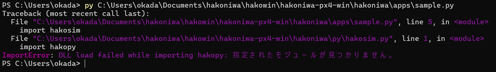

## 4.4. 追加機能を利用する場合

LiDARセンサーの追加や、カメラの撮影画素の変更など、デフォルト状態から変更して、シミュレータを利用する場合には、RamDiskの容量を増やす必要があります。初期値の64Mbyteでは足りなくなるケースがありますので、512Mbyteくらいに増やして対応してください。
