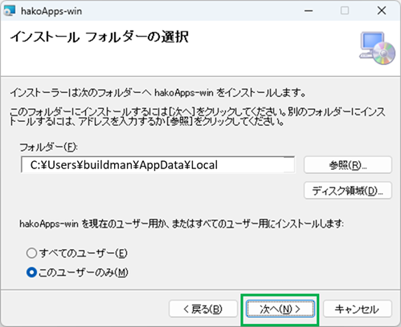

# 1. 前提条件

箱庭アプリをインストールするには、箱庭コア機能、lmdisk、Python 3.12のインストールが終わっていることが条件となります。

以下のドキュメントを参照して、事前にインストールしておいてください。

[箱庭コア機能のインストール手順](https://github.com/buildko89/documents/blob/main/hakodoc/wininstall-doc/coreinstall.md)

lmdisk、Ptython 3.12は箱庭コア機能のインストール時にインストールが済んでいるなら以下の手順は不要になります。

[lmdiskインストール手順](https://github.com/buildko89/documents/blob/main/hakodoc/preinstall-doc/lmdisk_install.md)

[Python3.12インストール手順](https://github.com/buildko89/documents/blob/main/hakodoc/preinstall-doc/python_install.md)

# 2. 箱庭アプリインストーラのダウンロード

箱庭ドローンシミュレータに必要な`箱庭アプリ`をインストールするためのインストーラを入手します。以下のリリースページに`hakoApps-win_vx.x.x.zip`で配布されています。

[箱庭アプリインストーラ](https://github.com/buildko89/appsinstaller/releases)

# 3. 箱庭アプリのインストール

`hakoApps-win_vx.x.x.zip`をダウンロードしたら、zipファイルを解凍します。解凍すると、`setup.exe`、`hakowin-msi`が解凍されます。

`setup.exe`を右クリックして、管理者として実行をクリックして実行します。

管理者モードで実行するか？と聞かれるのでOKをクリックしてインストールを実行してください。

インストール画面が表示されるので、次へ(N)>をクリックして次の画面に進みます。

インストール フォルダの選択画面が表示されます。インストール先はデフォルトでは`C:¥User¥<ユーザ名>¥AppData¥Local¥`になります。次へ(N)>をクリックして次の画面に進みます。

インストーラ先のフォルダの変更が必要な場合は変更して、次へ(N)>をクリックして次の画面に進みます。

⚠️インストール フォルダの選択について
Windows環境でOneDriveが設定されている場合には注意が必要です。OneDriveのバックアップ対象のフォルダ(例：Desktop,Documentsなど)を選択するとOneDriveにリダイレクトされるので注意してください。

インストールの確認画面がが出ますので、次へ(N)>をクリックして次の画面に進みます。

インストールが始まりますので、しばらく待ちます。

インストールが完了するとインストール完了の画面が表示されますので、閉じるをクリックしてインストールを完了します。

インストールが完了するとデスクトップ上にhakoApps-winのフォルダが作成されますので、フォルダをクリックして内容を確認してください。

