# 1. 前提条件

箱庭アプリをインストールするには、箱庭コア機能、lmdisk、Python 3.12のインストールが終わっていることが条件となります。
以下のドキュメントを参照して、事前にインストールしておいてください。

[lmdiskインストール手順](https://github.com/buildko89/documents/blob/main/hakodoc/preinstall-doc/lmdisk_install.md)

[Python3.12インストール手順](https://github.com/buildko89/documents/blob/main/hakodoc/preinstall-doc/python_install.md)

## 1.1. python環境について

箱庭コア機能のインストールを実行時に箱庭用のpythonモジュールを`pip`コマンドでインストールが実行されます。

python環境を構築したら、`pip`コマンドのupgradeが必要になる場合があるので、以下のコマンドを実行しておいてください。

```powershell
python -m  pip install --upgrade pip
```

# 2. 箱庭コア機能インストーラのダウンロード

箱庭ドローンシミュレータに必要な`箱庭コア機能`をインストールするためのインストーラを入手します。以下のリンクをクリックすると`hakoCore-win_vx.x.x.zip`がダウンロードされます。

[箱庭コア機能インストーラのzipファイル](https://github.com/buildko89/hakowin/releases/download/v1.0.2/hakoCore-win_v1.0.2.zip)

# 3. 箱庭コア機能のインストール

`hakoCore-win_vx.x.x.zip`をダウンロードしたら、zipファイルを解凍します。解凍すると、`setup.exe`、`hakocore-win-msi`が解凍されます。

`setup.exe`を右クリックして、管理者として実行をクリックして実行します。

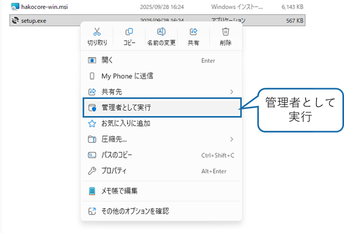

管理者モードで実行するか？と聞かれるのでOKをクリックしてインストールを実行してください。

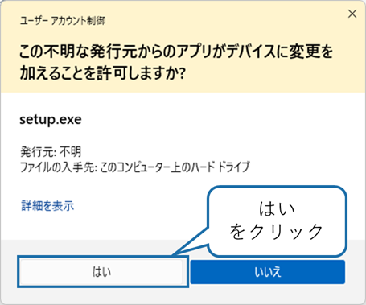

インストール画面が表示されるので、次へ(N)>をクリックして次の画面に進みます。

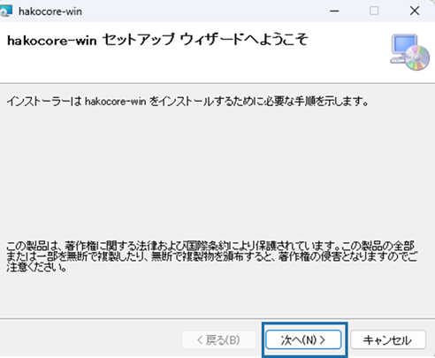

インストール フォルダの選択画面が表示されます。インストール先はデフォルトでは`C:¥User¥<ユーザ名>¥AppData¥Roming¥`になります。次へ(N)>をクリックして次の画面に進みます。

インストーラ先のフォルダの変更が必要な場合は変更して、次へ(N)>をクリックして次の画面に進みます。

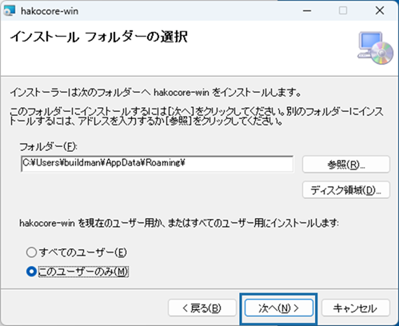

⚠️インストール フォルダの選択について
Windows環境でOneDriveが設定されている場合には注意が必要です。OneDriveのバックアップ対象のフォルダ(例：Desktop,Documentsなど)を選択するとOneDriveにリダイレクトされるので注意してください。

インストールの確認画面がが出ますので、次へ(N)>をクリックして次の画面に進みます。

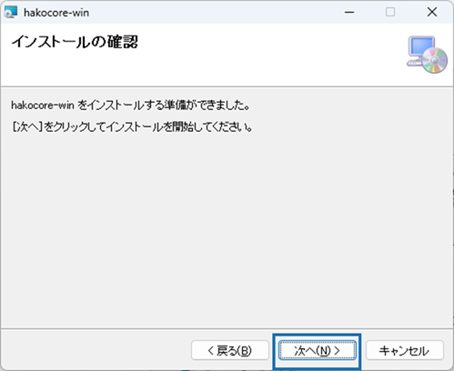

インストールが始まりますので、しばらく待ちます。

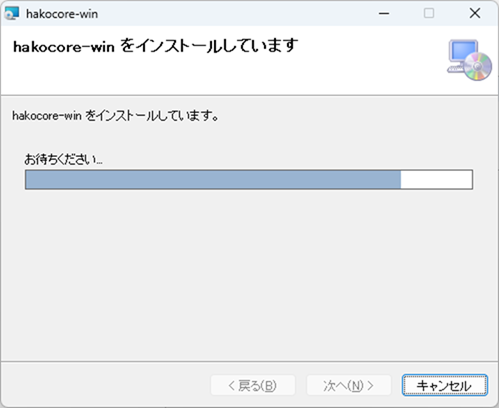

インストール中に箱庭ドローンシミュレータに必要なPythonライブラリがインストールされます。内容を確認してOKボタンをクリックします。

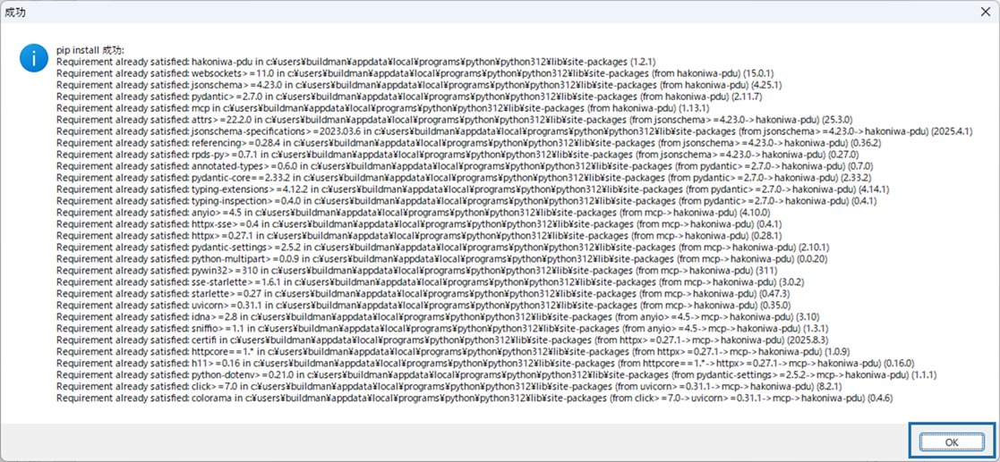

インストールが完了するとインストール完了の画面が表示されますので、閉じるをクリックしてインストールを完了します。

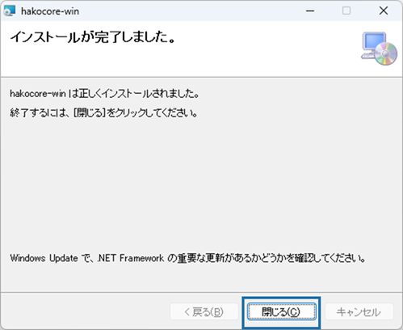

# 4. インストール後の確認

箱庭コア機能がインストールされたことを確認します。

タスクバーのWindowsマークを右クリックして、システムをクリックします。
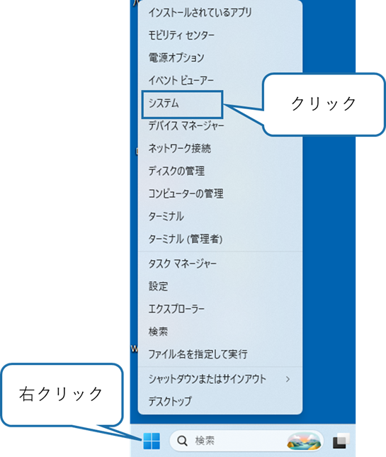

システムをクリックするとシステム＞バージョン情報の画面が表示されますので、システムの詳細設定をクリックします。

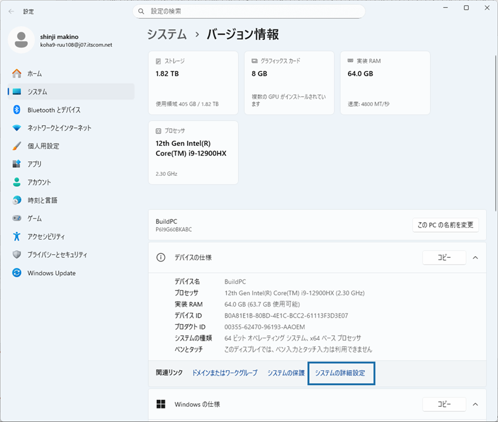

システムの詳細設定をクリックすると、システムのプロパティが表示されますので、環境変数をクリックします。

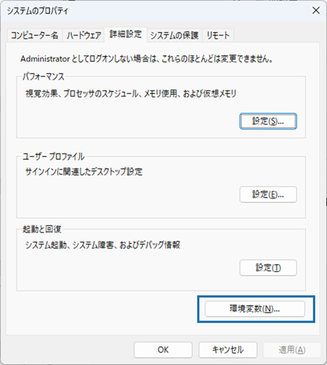

環境変数をクリックすると環境変数が確認できますので、以下の変数が登録されていることを確認してください。

|変数名|概要|
|:---|:---|
|HAKO_CONFIG_PATH|箱庭コアのコンフィグパス|
|PYTHONPATH|箱庭コアのPythonライブラリパス|

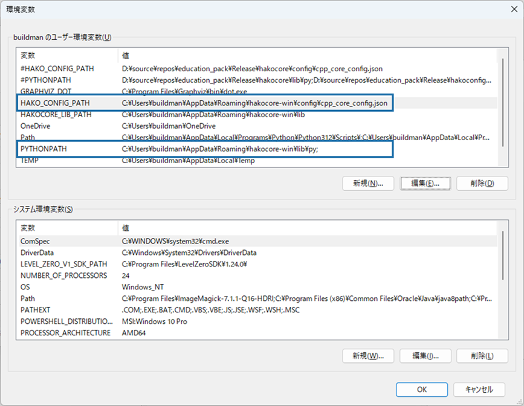

# 5. ⚠️トラブルシューティング⚠️

## 5.1. 環境変数が登録されていなかった場合

この場合は、管理者権限モードでインストールができてないことが原因ですので、管理者権限でインストールを実行してください。

## 5.2. pipの実行が失敗した場合

この場合は、Python 3.12の環境が事前にインストールされていないことが原因です。Python 3.12の環境をインストールして、箱庭コア機能をインストールを管理者権限で実行しなおしてください。

